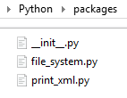

**[DISCLAIMER]** I am *NOT* sure how much of the following is *CORRECT* - but it works for me.

On my computer, the path to my 'parent' Python folder is:
```Console
C:\Users\Joe\Documents\My Programming\Python
```

**My `packages` folder**

Below my 'parent' Python folder, is my `packages` folder, where I have decided to start
adding generically useful methods - this is how that folder (a time of writing) looks.

<p alt="packages folder" align="center"></p>

**My `__init__.py` file**

This is my `__init__.py file
```Python
print("\n====================================================")
print("[PACKAGES] __init__.py called")

from . file_system import print_file_system_heartbeat

from . print_xml import print_xml_heartbeat
print("====================================================")
```

**My `file_system.py` file**

This is my `file_system.py` file
```Python
# ---------- ---------- ---------- ---------- ---------- ---------- ---------- ----------
# Module file_system.py
# Written by: Joe Dorward
# Started: 14/12/2024

    # ---------- ---------- ---------- ---------- ---------- ---------- ---------- ----------
def print_file_system_heartbeat():
    print("[TESTING] print_file_system_heartbeat() called")
    # ---------- ---------- ---------- ---------- ---------- ---------- ---------- ----------
```

**My `print_xml.py` file**

This is my `print_xml.py` file
```Python
# Module print_xml.py
# Written by: Joe Dorward
# Started: 11/12/2024

    # ---------- ---------- ---------- ---------- ---------- ---------- ---------- ----------
def print_xml_heartbeat():
    print("[TESTING] print_xml_heartbeat() called")
    # ---------- ---------- ---------- ---------- ---------- ---------- ---------- ----------
```

**My `testing_packages_v1.01.py` file**

This is my `testing_packages_v1.01.py` file
The `sys.path.insert(0, "C:/Users/Joe/Documents/My Programming/Python/")` line tells Python
where to look for anything (my packages) that it does not aready 'know' about.

```Python
# ---------- ---------- ---------- ---------- ---------- ---------- ---------- ----------
# Program testing_packages_v1.01.py
# Written by: Joe Dorward
# Started: 10/12/2024

import sys
sys.path.insert(0, "C:/Users/Joe/Documents/My Programming/Python/")
from packages import file_system, print_xml

# MAIN ///// ////////// ////////// ////////// ////////// ////////// ////////// //////////
if __name__ == '__main__':        

    file_system.print_file_system_heartbeat()
    print_xml.print_xml_heartbeat()
```

When `testing_packages_v1.01.py` runs, `print_file_system_heartbeat()`,
and `print_xml_heartbeat()` prints their output to the console.

```Console
====================================================
[PACKAGES] __init__.py called
====================================================
[TESTING] print_file_system_heartbeat() called
[TESTING] print_xml_heartbeat() called
```
