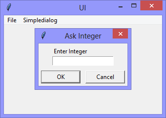

|`ui_v1.02_menubar.py`|`ui_v1.03_askinteger.py`|`ui_v1.05_label_entry.py`|
|-|-|-|
||||

I love up-skilling.
Between jobs, I take advantage of the 'time off' to build on what I learned in my last role, or expand my knowledge in other areas.
This time, I'm digging more deeply into the use of the Tkinter package (it comes with Python) to create Python applications with 'proper' user interfaces. 

If you have (or can get) Python installed, you can follow along at home. 
Just copy-n-paste each version of the fully-working example applications as I go, and have fun!
# ----------- ----------- ----------- ----------- ----------- ----------- ----------- -----------
