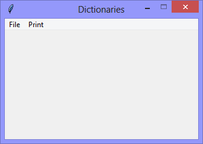
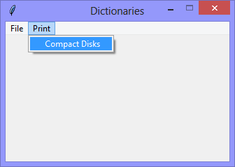

Continuing the exploration of using Tkinter with Python, this version
begins the exploration of using Python *Dictionaries* for storing and
processing data.

In Python, *Dictionaries* are generally referred to as being 
"*lists of key - value pairs*", with the first-item of the pair being the
**key**, and the second-item of the pair being the **value**.

In any dictionary, **keys** *MUST BE* unique, but **values** *CAN BE*
duplicates (or more). In this version, the *Dictionary* is hard-coded.
In it, the keys are unique, but there is a duplicate value.

Although the keys in this example are unique within the dictionary, it
*IS NOT* a 'good' example of a Python dictionary - the keys in this example
are as much data as the values are. 
In a better example, the keys would be more-like unique-identifiers
(in the database sense) and less-like unique data-values.

```Python
compact_disk_dictionary = {
    'Flesh & Blood':'Roxy Music',
    'Hunky Dory':'David Bowie',
    'Rio':'Duran Duran',
    'Avalon':'Roxy Music'
}
```

|||
|-|-|
|||

When the `Print` > `Compact Disks` option is selected, the keys and values
in the dictionary are printed to the console.

```Console
[DEBUG] print_Dictionary({}) called

There are: 4 Compact Disks:
  Title=Flesh & Blood, Artist=Roxy Music
  Title=Hunky Dory, Artist=David Bowie
  Title=Rio, Artist=Duran Duran
  Title=Avalon, Artist=Roxy Music
```

```Python
# ---------- ---------- ---------- ---------- ---------- ---------- ---------- ----------
# Program dictionaries_v1.01_hard_coded_flat.py
# Written by: Joe Dorward
# Started: 10/12/2024

# This program creates a Tkinter user interface
# * adds the import reference to 'Tk'
# * adds the import reference to 'Menu'
# * adds the menubar_1
# dictionaries_v1.01_hard_coded_flat
# * adds the hard-coded dictionary named 'compact_disk_dictionary'
# * adds the 'Print' menu to menubar_1
# * adds the 'Compact Disks' option to the 'Print' menu
# * adds the handler (method) for the 'Compact Disks' option

from tkinter import Tk, Menu

compact_disk_dictionary = {
    'Flesh & Blood':'Roxy Music',
    'Hunky Dory':'David Bowie',
    'Rio':'Duran Duran',
    'Avalon':'Roxy Music'
}
# ========== ========== ========== ========== ========== ========== ========== ==========
# MENUBAR
# ========== ========== ========== ========== ========== ========== ========== ==========
def add_Menubar(parent_widget):
    # adds menubar_1
    print("[DEBUG] add_Menubar() called")

    menubar_1 = Menu(parent_widget, name='menubar_1')

    # ---------- ---------- ---------- ---------- ---------- 
    # add file_menu to menubar_1
    file_menu = Menu(menubar_1, name='file_menu')
    menubar_1.add_cascade(menu=file_menu, label='File')
    
    # add options
    file_menu.add_command(label='Quit',
                          command=parent_widget.quit)
    # ---------- ---------- ---------- ---------- ----------
    # add 'Print' menu
    print_menu = Menu(menubar_1)
    menubar_1.add_cascade(menu=print_menu, label='Print')

    # add options
    print_menu.add_command(label='Compact Disks',
                           command=lambda:print_Dictionary(compact_disk_dictionary))
    # ---------- ---------- ---------- ---------- ----------

    # show menubar_1 in the user interface
    parent_widget['menu'] = menubar_1
# ========== ========== ========== ========== ========== ========== ========== ==========
def print_Dictionary(dictionary):
    # prints data from a dictionary
    print("[DEBUG] print_Dictionary({}) called\n")

    print("There are: {} Compact Disks:".format(len(dictionary)))

    for each_key in dictionary:
        print("  Title={}, Artist={}".format(each_key, dictionary[each_key]))
# MAIN ///// ////////// ////////// ////////// ////////// ////////// ////////// //////////
if __name__ == '__main__':        
    print("====================================================")

    ui_left = 10
    ui_top = 10

    # set UI window proportions to 16:9
    ui_width = 16 * 20
    ui_height = 9 * 20

    # create the 'blank' user interface
    ui = Tk()
    ui.title("Dictionaries")
    ui.geometry('%dx%d+%d+%d' % (ui_width, ui_height, ui_left, ui_top))
    ui.wm_resizable(width=False, height=False)
    ui.option_add('*tearOff', False)

    # ---------- ---------- ---------- ---------- ---------- ---------- ---------- ----------
    # build the user interface
    add_Menubar(ui)

    print("The user interface is built!")
    print("----------------------------------------------------")
    # ---------- ---------- ---------- ---------- ---------- ---------- ---------- ----------

    ui.mainloop()
```
