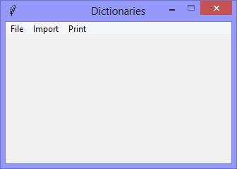
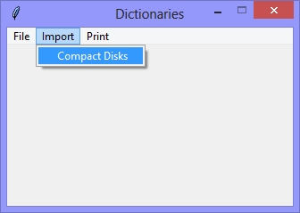
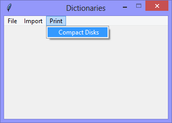

Continuing the exploration of using Tkinter with Python, this version
further explores the use of Python Dictionaries by introducing dictionaries
nested within another dictionary. 
This version also adds importing its data from the XML file below.

Notice that the `<identifier>` elements have unique values, this
version will use those unique values as the **keys** of the dictionary.

```XML
<?xml version="1.0" encoding="UTF-8"?>
<compact-disks>
    <compact-disk>
        <identifier>123-1234</identifier>
        <title>Flesh and Blood</title>
        <artist>Roxy Music</artist>
    </compact-disk>
    <compact-disk>
        <identifier>123-1235</identifier>
        <title>Hunky Dory</title>
        <artist>David Bowie</artist>
    </compact-disk>
    <compact-disk>
        <identifier>123-1236</identifier>
        <title>Rio</title>
        <artist>Duran Duran</artist>
    </compact-disk>
    <compact-disk>
        <identifier>123-1237</identifier>
        <title>Avalon</title>
        <artist>Roxy Music</artist>
    </compact-disk>
</compact-disks>
```

||||
|-|-|-|
||||

When the `Import` > `Compact Disks` option is selected, the data from a selected
file are read into the *Dictionary*.

When the `Print` > `Compact Disks` option is selected, the items in the dictionary are
printed to the console.

```Console
There are: 4 Compact Disks:
  key=123-1234, title=Flesh and Blood, artist=Roxy Music
  key=123-1235, title=Hunky Dory, artist=David Bowie
  key=123-1236, title=Rio, artist=Duran Duran
  key=123-1237, title=Avalon, artist=Roxy Music
```

```Python
# ---------- ---------- ---------- ---------- ---------- ---------- ---------- ----------
# Program dictionaries_v1.02_xml_file.py
# Written by: Joe Dorward
# Started: 10/12/2024

# This program creates a Tkinter user interface
# * adds the import reference to 'Tk'
# * adds the import reference to 'Menu'
# * adds the menubar_1
# dictionaries_v1.02_xml_file
# * redefines the 'compact_disk_dictionary' to be an empty list
# * adds the import reference to 'os'
# * adds the import reference to 'filedialog'
# * adds the import reference to 'xml.dom.minidom'
# * adds the 'Import' menu to menubar_1
# * adds the 'Compact Disks' option to the 'Import' menu
# * adds the handler (method) for the 'Import > Compact Disks' option
# * updates the handler (method) for the 'Print > Compact Disks' option

import os
from tkinter import Tk, Menu, filedialog as filedialog_1
import xml.dom.minidom

compact_disk_dictionary = {}
# ========== ========== ========== ========== ========== ========== ========== ==========
# MENUBAR
# ========== ========== ========== ========== ========== ========== ========== ==========
def add_Menubar(parent_widget):
    # adds menubar_1
    print("[DEBUG] add_Menubar() called")

    menubar_1 = Menu(parent_widget, name='menubar_1')

    # ---------- ---------- ---------- ---------- ---------- 
    # add file_menu to menubar_1
    file_menu = Menu(menubar_1, name='file_menu')
    menubar_1.add_cascade(menu=file_menu, label='File')
    
    # add options
    file_menu.add_command(label='Quit',
                          command=parent_widget.quit)
    # ---------- ---------- ---------- ---------- ----------
    # add 'Import' menu
    import_menu = Menu(menubar_1)
    menubar_1.add_cascade(menu=import_menu, label='Import')

    # add options
    import_menu.add_command(label='Compact Disks',
                            command=import_Compact_Disk_Data)
    # ---------- ---------- ---------- ---------- ----------
    # add 'Print' menu
    print_menu = Menu(menubar_1)
    menubar_1.add_cascade(menu=print_menu, label='Print')

    # add options
    print_menu.add_command(label='Compact Disks',
                           command=lambda:print_Compact_Disk_Dictionary(compact_disk_dictionary))
    # ---------- ---------- ---------- ---------- ----------

    # show menubar_1 in the user interface
    parent_widget['menu'] = menubar_1
# ========== ========== ========== ========== ========== ========== ========== ==========
def import_Compact_Disk_Data():
    # imports xml data into a dictionary
    print("[DEBUG] import_Compact_Disk_Data({}) called\n")

    path_to_data_file = get_Path_Of_Selected_File()

    compact_disk_list = get_Compact_Disk_List(path_to_data_file)

    add_Compact_Disk_Data_To_Dictionary(compact_disk_list)
    # ---------- ---------- ---------- ---------- ---------- ---------- ---------- ----------
def get_Path_Of_Selected_File():
    # returns the path of the selected file

    path_of_selected_file =  filedialog_1.askopenfilename(
        title='Select File',
        initialdir=os.getcwd,
        filetypes=(
            ('XML files', '*.xml'),
            ('All other files', '*.*')
        )
    )
    return path_of_selected_file
    # ---------- ---------- ---------- ---------- ---------- ---------- ---------- ----------
def get_Compact_Disk_List(path_to_file):
    # gets a list of compact disks from the xml-file
    print("[DEBUG] get_Compact_Disk_List() called")

    xml_file_handle = xml.dom.minidom.parse(path_to_file)
    compact_disk_list = xml_file_handle.getElementsByTagName('compact-disk')

    return compact_disk_list
    # ---------- ---------- ---------- ---------- ---------- ---------- ---------- ----------
def add_Compact_Disk_Data_To_Dictionary(compact_disks_list):
    # adds compact disk data to dictionary
    print("[DEBUG] add_Compact_Disk_Data_To_Dictionary() called")

    for each_parent_node in compact_disks_list:
        for each_child_node in each_parent_node.childNodes:            
            if (each_child_node.nodeType == 1):

                if each_child_node.nodeName == 'identifier':
                    item_number = each_child_node.firstChild.nodeValue

                if each_child_node.nodeName == 'title':
                    title = each_child_node.firstChild.nodeValue

                elif each_child_node.nodeName == 'artist':
                    artist = each_child_node.firstChild.nodeValue

        compact_disk_dictionary.update({item_number: {'title':title, 'artist':artist}} )
    # ---------- ---------- ---------- ---------- ---------- ---------- ---------- ----------
def print_Compact_Disk_Dictionary(dictionary):
    # prints data from a two-level-dictionary
    print("[DEBUG] print_Compact_Disk_Dictionary() called")

    print("There are: {} Compact Disks:".format(len(dictionary)))

    for each_key, each_key_data in dictionary.items():
        title_value = each_key_data['title']
        artist_value = each_key_data['artist']

        print("  key={}, title={}, artist={}".format(each_key, title_value, artist_value))
# MAIN ///// ////////// ////////// ////////// ////////// ////////// ////////// //////////
if __name__ == '__main__':        
    print("====================================================")

    ui_left = 10
    ui_top = 10

    # set UI window proportions to 16:9
    ui_width = 16 * 20
    ui_height = 9 * 20

    # create the 'blank' user interface
    ui = Tk()
    ui.title("Dictionaries")
    ui.geometry('%dx%d+%d+%d' % (ui_width, ui_height, ui_left, ui_top))
    ui.wm_resizable(width=False, height=False)
    ui.option_add('*tearOff', False)

    # ---------- ---------- ---------- ---------- ---------- ---------- ---------- ----------
    # build the user interface
    add_Menubar(ui)

    print("The user interface is built!")
    print("----------------------------------------------------")
    # ---------- ---------- ---------- ---------- ---------- ---------- ---------- ----------

    ui.mainloop()
```
