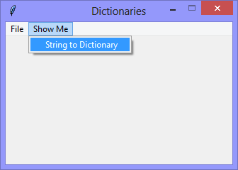

Continuing the exploration of using Tkinter with Python, this version
continues the exploration of using Python *Dictionaries* for storing and
processing data.

This version demonstrates how the dictionary-like string `dictionary_string`
(below) can be used to populate an actual Python dictionary.

```Python
dictionary_string = "{ 'SW-0001': {'stencil': 'Visio-Switches.vss', 'model': 'SW-1-1-1-A'} }"
```

||
|-|
||

When the `Show Me` > `String to Dictionary` option is selected, content of
`dictionary_string` is comverted and used to populate `dictionary` with the
steps of the process being printed to the console.

```Console
dictionary_string={ 'SW-0001': {'stencil': 'Visio-Switches.vss', 'model': 'SW-1-1-1-A'} }
the 'type' of 'dictionary_string'='str'

the dictionary={'SW-0001': {'stencil': 'Visio-Switches.vss', 'model': 'SW-1-1-1-A'}}
the 'type' of 'dictionary'='dict'
```

**[NOTICE]** that the type of `dictionary_string` is `str`, while the type of `dictionary` is `dict`.

```Python
# ---------- ---------- ---------- ---------- ---------- ---------- ---------- ----------
# Program dictionaries_v1.07_string_to_dictionary.py
# Written by: Joe Dorward
# Started: 17/12/2024

# This program creates a Tkinter user interface
# * adds the import reference to 'Tk'
# * adds the import reference to 'Menu'
# * adds the menubar_1
# dictionaries_v1.07_str_to_dict

import json
from tkinter import Tk, Menu
# ========== ========== ========== ========== ========== ========== ========== ==========
# MENUBAR
# ========== ========== ========== ========== ========== ========== ========== ==========
def add_Menubar(parent_widget):
    # adds menubar_1
    print("[DEBUG] add_Menubar() called")

    menubar_1 = Menu(parent_widget, name='menubar_1')

    # ---------- ---------- ---------- ---------- ---------- 
    # add file_menu to menubar_1
    file_menu = Menu(menubar_1, name='file_menu')
    menubar_1.add_cascade(menu=file_menu, label='File')
    
    # add options
    file_menu.add_command(label='Quit',
                          command=parent_widget.quit)
    # ---------- ---------- ---------- ---------- ----------
    # add 'Show Me' menu
    show_me_menu = Menu(menubar_1)
    menubar_1.add_cascade(menu=show_me_menu, label='Show Me')

    # add options
    show_me_menu.add_command(label='String to Dictionary',
                            command=show_me)

    # ---------- ---------- ---------- ---------- ----------

    # show menubar_1 in UI
    parent_widget['menu'] = menubar_1
    # ---------- ---------- ---------- ---------- ---------- ---------- ---------- ----------
def show_me():
    # demonstrates the conversion of a dictionary-string to a dictionary

    dictionary_string = "{ 'SW-0001': {'stencil': 'Visio-Switches.vss', 'model': 'SW-1-1-1-A'} }"
    print("dictionary_string={}".format(dictionary_string))    
    print("the 'type' of 'dictionary_string'='{}'".format(type(dictionary_string).__name__))

    dictionary = dictionary_string_to_dictionary(dictionary_string)
    print("\nthe dictionary={}".format(dictionary))
    print("the 'type' of 'dictionary'='{}'".format(type(dictionary).__name__))
    # ---------- ---------- ---------- ---------- ---------- ---------- ---------- ----------
def dictionary_string_to_dictionary(dictionary_string):
    # converts a dictionary_string to a dictionary

    dictionary_string = dictionary_string.replace(chr(39), chr(34))
 
    return json.loads(dictionary_string)
# MAIN ///// ////////// ////////// ////////// ////////// ////////// ////////// //////////
if __name__ == '__main__':        
    print("====================================================")

    ui_left = 10
    ui_top = 10

    # set UI window proportions to 16:9
    ui_width = 16 * 20
    ui_height = 9 * 20

    # create the 'blank' user interface
    ui = Tk()
    ui.title("Dictionaries")
    ui.geometry('%dx%d+%d+%d' % (ui_width,
                                 ui_height,
                                 ui_left,
                                 ui_top))
    ui.wm_resizable(width=False, height=False)
    ui.option_add('*tearOff', False)

    # ---------- ---------- ---------- ---------- ---------- ---------- ---------- ----------
    # build the user interface
    add_Menubar(ui)
    print("The 'blank' user interface is built!")
    print("----------------------------------------------------")
    # ---------- ---------- ---------- ---------- ---------- ---------- ---------- ----------

    ui.mainloop()
```
