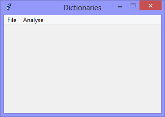
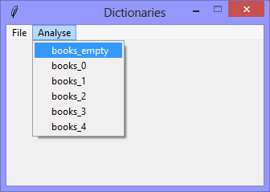
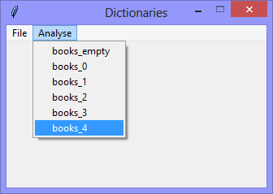

Continuing the exploration of using Tkinter with Python *Dictionaries*,
this version demonstrates how to analyse a dictionary with a recursive function.

The application has a few hard-coded dictionaries, progressively more complex,
from `books_empty` to `books_4`, to demonstrate how the application can handle
Python dictionaries of 'unknown' depth.

**`books_empty`**
|||
|-|-|
|||

When the `Analyse` > `books_empty` option is selected, the application prints
its analysis to the console.
. 
```Console
Analysing 'books_empty'

 The dictionary is empty
```
**`books_4`**
|||
|-|-|
|||

When the `Analyse` > `books_4` option is selected, the application prints
its analysis to the console
```Console
Analysing 'books_4'

  'BID_12345' is a dictionary
    'title' is NOT a dictionary
    'author' is NOT a dictionary
    'publisher' is a dictionary
      'name' is NOT a dictionary
      'address' is NOT a dictionary
    'book_information' is a dictionary
      'size' is a dictionary
        'width' is NOT a dictionary
        'height' is NOT a dictionary
        'weights' is a dictionary
          'imperial' is NOT a dictionary
          'metric' is NOT a dictionary
      'cover' is NOT a dictionary
      'dust_jacket' is NOT a dictionary
```
**[NOTE]** that 
`BID_12345` is a dictionary, that 
`book_information` is a sub-dictionary, that
`size` is a sub-sub-dictionary, and that
`weights` is a sub-sub-sub-dictionary.

```Python
# ---------- ---------- ---------- ---------- ---------- ---------- ---------- ----------
# Program dictionaries_v1.08_recursive_analysis.py
# Written by: Joe Dorward
# Started: 20/12/2024

# This program creates a Tkinter user interface
# * adds the import reference to 'Tk'
# * adds the import reference to 'Menu'
# * adds the menubar_1
# dictionaries_v1.08_recursive_analysis
# * adds the hard-coded dictionaries 'books_0' .etc
# * adds the 'Analyse' menu to menubar_1
# * adds the 'books_0' .etc options to the 'Analyse' menu
# * adds the 'books_0' .etc handler (methods) for their corresponding options

from tkinter import Tk, Menu

books_empty = {}
books_0 =   { 'BID_12345': 'Untamed' } # 0-subs

books_1 =   {   'BID_12345': 
                { 
                    'title':'Untamed',
                    'author':'Glennon Doyle'
                } 
            } # 1-sub

books_2 =   {   'BID_12345': 
                { 
                    'title':'Untamed',
                    'author':'Glennon Doyle',
                    'publisher':
                    {
                        'name':'Vermilion', 
                        'address':'20 Vauxhall Bridge Road'
                    }
                }
            } # 1-sub, 1-sub-sub

books_3 =   {   'BID_12345': 
                { 
                    'title':'Untamed',
                    'author':'Glennon Doyle',
                    'publisher':
                    {
                        'name':'Vermilion', 
                        'address':'20 Vauxhall Bridge Road'
                    },
                    'book_information':
                    { 
                        'size': 
                        {
                            'width':'five', 
                            'height':'eight'
                        },
                        'cover':'paperback',
                        'dust_jacket':'no'
                    }
                }
            } # 1-sub, 2-sub-subs, 1 sub-sub-sub

books_4 =   {   'BID_12345': 
                { 
                    'title':'Untamed',
                    'author':'Glennon Doyle',
                    'publisher':
                    {
                        'name':'Vermilion', 
                        'address':'20 Vauxhall Bridge Road'
                    },
                    'book_information':
                    { 
                        'size': 
                        {
                            'width':'five', 
                            'height':'eight',
                            'weights':
                            {
                                'imperial':'six',
                                'metric':'one forty'
                            }
                        },
                        'cover':'paperback',
                        'dust_jacket':'no'
                    }
                }
            } # 1-sub, 2-sub-subs, 1 sub-sub-sub, 1 sub-sub-sub-sub
# ========== ========== ========== ========== ========== ========== ========== ==========
# MENUBAR
# ========== ========== ========== ========== ========== ========== ========== ==========
def add_Menubar(parent_widget):
    # adds menubar_1
    print("[DEBUG] add_Menubar() called")

    menubar_1 = Menu(parent_widget, name='menubar_1')

    # ---------- ---------- ---------- ---------- ---------- 
    # add file_menu to menubar_1
    file_menu = Menu(menubar_1, name='file_menu')
    menubar_1.add_cascade(menu=file_menu, label='File')
    
    # add options
    file_menu.add_command(label='Quit',
                          command=parent_widget.quit)
    # ---------- ---------- ---------- ---------- ----------
    # add 'Analyse' menu
    analyse_menu = Menu(menubar_1)
    menubar_1.add_cascade(menu=analyse_menu, label='Analyse')

    # add options
    analyse_menu.add_command(label='books_empty', command=analyse_books_empty)
    analyse_menu.add_command(label='books_0', command=analyse_books_0)
    analyse_menu.add_command(label='books_1', command=analyse_books_1)
    analyse_menu.add_command(label='books_2', command=analyse_books_2)
    analyse_menu.add_command(label='books_3', command=analyse_books_3)
    analyse_menu.add_command(label='books_4', command=analyse_books_4)
    # ---------- ---------- ---------- ---------- ----------

    # show menubar_1 in UI
    parent_widget['menu'] = menubar_1
# ========== ========== ========== ========== ========== ========== ========== ==========
def analyse_books_empty() -> None:
    # handles the analysis of 'books_empty'
    print("Analysing 'books_empty'\n")
    analyse_this(dictionary=books_empty, indentation='')
    print("====================================================")
    # ---------- ---------- ---------- ---------- ---------- ---------- ---------- ----------
def analyse_books_0() -> None:
    # handles the analysis of 'books_0'
    print("Analysing 'books_0'\n")
    analyse_this(dictionary=books_0, indentation='')
    print("====================================================")
    # ---------- ---------- ---------- ---------- ---------- ---------- ---------- ----------
def analyse_books_1() -> None:
    # handles the analysis of 'books_1'
    print("Analysing 'books_1'\n")
    analyse_this(dictionary=books_1, indentation='')
    print("====================================================")
    # ---------- ---------- ---------- ---------- ---------- ---------- ---------- ----------
def analyse_books_2() -> None:
    # handles the analysis of 'books_2'
    print("Analysing 'books_2'\n")
    analyse_this(dictionary=books_2, indentation='')
    print("====================================================")
    # ---------- ---------- ---------- ---------- ---------- ---------- ---------- ----------
def analyse_books_3() -> None:
    # handles the analysis of 'books_3'
    print("Analysing 'books_3'\n")
    analyse_this(dictionary=books_3, indentation='')
    print("====================================================")
    # ---------- ---------- ---------- ---------- ---------- ---------- ---------- ----------
def analyse_books_4() -> None:
    # handles the analysis of 'books_4'
    print("Analysing 'books_4'\n")
    analyse_this(dictionary=books_4, indentation='')
    print("====================================================")
# ========== ========== ========== ========== ========== ========== ========== ==========
def analyse_this(dictionary: dict, indentation: str) -> None:
    # recursively analyses the structure of a dictionary

    if (len(dictionary) > 0):
        for each_key in dictionary:
            if is_dictionary(dictionary[each_key]):
                print(" {} '{}' is a dictionary".format(indentation, each_key))

                analyse_this(dictionary[each_key], indentation + '  ')
            else:
                print(" {} '{}' is NOT a dictionary".format(indentation, each_key))
    else:
        print(" The dictionary is empty")
    # ---------- ---------- ---------- ---------- ---------- ---------- ---------- ----------
def is_dictionary(key) -> bool:
    # returns 'True' if key is a dictionary

    if (type(key).__name__ == 'dict'):
        return True
# MAIN ///// ////////// ////////// ////////// ////////// ////////// ////////// //////////
if __name__ == '__main__':        
    print("====================================================")

    ui_left = 10
    ui_top = 10

    # set UI window proportions to 16:9
    ui_width = 16 * 20
    ui_height = 9 * 20

    # create the 'blank' user interface
    ui = Tk()
    ui.title("Dictionaries")
    ui.geometry('%dx%d+%d+%d' % (ui_width,
                                 ui_height,
                                 ui_left,
                                 ui_top))
    ui.wm_resizable(width=False, height=False)
    ui.option_add('*tearOff', False)

    # ---------- ---------- ---------- ---------- ---------- ---------- ---------- ----------
    # build the user interface
    add_Menubar(ui)
    print("The 'blank' user interface is built!")
    print("----------------------------------------------------")
    # ---------- ---------- ---------- ---------- ---------- ---------- ---------- ----------

    ui.mainloop()
```
