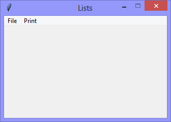
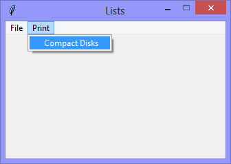

Continuing the exploration of using Tkinter with Python, this version 
begins the exploration of using Python *Lists* for storing and processing
data.

In this version, the *List* is hard-coded.
```Python
compact_disk_list = ['Pelican West', 'Hunky Dory', 'Rio', 'Avalon']
```

|||
|-|-|
|||

When the `Print` > `Compact Disks` option is selected, the items in the
list are printed to the console.

```Console
[DEBUG] print_List() called

There are: 4 Compact Disks
  Pelican West
  Hunky Dory
  Rio
  Avalon
```

```Python
# ---------- ---------- ---------- ---------- ---------- ---------- ---------- ----------
# Program lists_v1.01.py
# Written by: Joe Dorward
# Started: 08/12/2024

# This program creates a Tkinter user interface
# * adds the import reference to 'Tk'
# * adds the import reference to 'Menu'
# * adds the menubar_1
# lists_v1.01.py
# * adds the hard-coded list named 'compact_disk_list'
# * adds the 'Print' menu to menubar_1
# * adds the 'Compact Disks' option to the 'Print' menu
# * adds the handler (method) for the 'Compact Disks' option

from tkinter import Tk, Menu

compact_disk_list = ['Pelican West', 'Hunky Dory', 'Rio', 'Avalon']
# ========== ========== ========== ========== ========== ========== ========== ==========
# MENUBAR
# ========== ========== ========== ========== ========== ========== ========== ==========
def add_Menubar(parent_widget):
    # adds menubar_1
    print("[DEBUG] add_Menubar() called")

    menubar_1 = Menu(parent_widget, name='menubar_1')

    # ---------- ---------- ---------- ---------- ---------- 
    # add file_menu to menubar_1
    file_menu = Menu(menubar_1, name='file_menu')
    menubar_1.add_cascade(menu=file_menu, label='File')
    
    # add options
    file_menu.add_command(label='Quit',
                          command=parent_widget.quit)
    # ---------- ---------- ---------- ---------- ----------
    # add 'Print' menu
    print_menu = Menu(menubar_1)
    menubar_1.add_cascade(menu=print_menu, label='Print')

    # add options
    print_menu.add_command(label='Compact Disks',
                           command=lambda:print_List(compact_disk_list))
    # ---------- ---------- ---------- ---------- ----------

    # show menubar_1 in the user interface
    parent_widget['menu'] = menubar_1
# ========== ========== ========== ========== ========== ========== ========== ==========
def print_List(the_list):
    # prints a list
    print("[DEBUG] print_List() called\n")

    print("There are: {} Compact Disks:".format(len(the_list)))

    for each_item in the_list:
        print("  {}".format(each_item))
# MAIN ///// ////////// ////////// ////////// ////////// ////////// ////////// //////////
if __name__ == '__main__':        
    print("====================================================")

    ui_left = 10
    ui_top = 10

    # set UI window proportions to 16:9
    ui_width = 16 * 20
    ui_height = 9 * 20

    # create the 'blank' user interface
    ui = Tk()
    ui.title("Lists")
    ui.geometry('%dx%d+%d+%d' % (ui_width, ui_height, ui_left, ui_top))
    ui.wm_resizable(width=False, height=False)
    ui.option_add('*tearOff', False)

    # ---------- ---------- ---------- ---------- ---------- ---------- ---------- ----------
    # build the user interface
    add_Menubar(ui)

    print("The user interface is built!")
    print("----------------------------------------------------")
    # ---------- ---------- ---------- ---------- ---------- ---------- ---------- ----------

    ui.mainloop()
```
