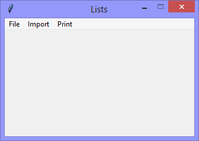
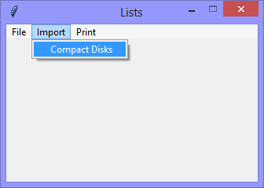

Continuing the exploration of using Tkinter with Python, this version continues
the exploration of using Python *Lists* for storing and processing
data, by reading data into the *List* from a file

|||
|-|-|
|||

When the `Import` > `Compact Disks` option is selected, the data from a selected file are read into the *List*.

```Console
There are: 4 Compact Disks:
  Pelican West
  Hunky Dory
  Rio
  Avalon
```
