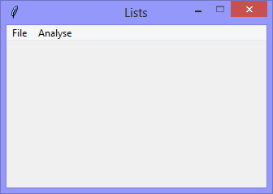

Continuing the exploration of using Tkinter with Python *Lists*,
this version demonstrates how to analyse a list with a recursive function.

The application has a few hard-coded lists, progressively more complex,
from `months_0` to `months_4`, to demonstrate how the application can handle
Python lists of 'unknown' depth.

|||
|-|-|
|||

When the `Analyse` > `months_4` option is selected, the application prints
its analysis to the console.
```Console
Analysing 'months_4'

  item 'months_4' is NOT a list
  item 'the months in these languages' is NOT a list
  item '2' is a list
    item 'English' is NOT a list
    item '1' is a list
      item '0' is a list
        item 'January' is NOT a list
        item '1' is a list
          item 'Public Holidays' is NOT a list
          item '1' is NOT a list
          item '23' is NOT a list
          item '24' is NOT a list
      item 'February' is NOT a list
      item 'March' is NOT a list
      item 'April' is NOT a list
      item 'May' is NOT a list
      item 'June' is NOT a list
      item 'July' is NOT a list
      item '7' is a list
        item 'August' is NOT a list
        item '1' is a list
          item 'Public Holidays' is NOT a list
          item '4' is NOT a list
          item '30' is NOT a list
      item 'September' is NOT a list
      item 'October' is NOT a list
      item 'November' is NOT a list
      item 'December' is NOT a list
      ...
```
**[NOTE]** that 


```Python
# ---------- ---------- ---------- ---------- ---------- ---------- ---------- ----------
# Program lists_v4.01_recursive_analysis.py
# Written by: Joe Dorward
# Started: 28/12/2024

# This program creates a Tkinter user interface
# * adds the import reference to 'Tk'
# * adds the import reference to 'Menu'
# * adds the menubar_1
# lists_v4.01_recursive_analysis
# * adds the hard-coded lists 'months_0' .etc
# * adds the 'Analyse' menu to menubar_1
# * adds the 'months_0' .etc options to the 'Analyse' menu
# * adds the 'months_0' .etc handler (methods) for their corresponding options

from tkinter import Tk, Menu

months_0 = []

months_1 = [ 'months_1',
    'the months in English',
    ['January', 'February', 'March', 'April', 'May', 'June', 'July', 'August', 'September', 'October', 'November', 'December']
]

months_2 = [ 'months_2',
    'the months in these languages',
    ['English', 'January', 'February', 'March', 'April', 'May', 'June', 'July', 'August', 'September', 'October', 'November', 'December'],
    ['French', 'Janvier', 'Février', 'Mars', 'Avril', 'Mai', 'Juin', 'Juillet', 'Août', 'Septembre', 'Octobre', 'November', 'Décembre']
]
months_3 = [ 'months_3',
    'the months in these languages',
    ['English', ['January', 'February', 'March', 'April', 'May', 'June', 'July', 'August', 'September', 'October', 'November', 'December']],
    ['French', ['Janvier', 'Février', 'Mars', 'Avril', 'Mai', 'Juin', 'Juillet', 'Août', 'Septembre', 'Octobre', 'November', 'Décembre']]
]
months_4 = [ 'months_4',
    'the months in these languages',
    ['English', [['January', ['Public Holidays', 1, 23, 24]], 'February', 'March', 'April', 'May', 'June', 'July',
                 ['August', ['Public Holidays', 4, 30]], 'September', 'October', 'November', 'December']],
    ['French', ['Janvier', 'Février', 'Mars', 'Avril', 'Mai', 'Juin', 'Juillet', 'Août', 'Septembre', 'Octobre', 'November', 'Décembre']]
]
# ========== ========== ========== ========== ========== ========== ========== ==========
# MENUBAR
# ========== ========== ========== ========== ========== ========== ========== ==========
def add_Menubar(parent_widget):
    # adds menubar_1
    print("[DEBUG] add_Menubar() called")

    menubar_1 = Menu(parent_widget, name='menubar_1')

    # ---------- ---------- ---------- ---------- ---------- 
    # add file_menu to menubar_1
    file_menu = Menu(menubar_1, name='file_menu')
    menubar_1.add_cascade(menu=file_menu, label='File')
    
    # add options
    file_menu.add_command(label='Quit',
                          command=parent_widget.quit)
    # ---------- ---------- ---------- ---------- ----------
    # add 'Analyse' menu
    analyse_menu = Menu(menubar_1)
    menubar_1.add_cascade(menu=analyse_menu, label='Analyse')

    # add options
    analyse_menu.add_command(label='months_0', command=analyse_months_0)
    analyse_menu.add_command(label='months_1', command=analyse_months_1)
    analyse_menu.add_command(label='months_2', command=analyse_months_2)
    analyse_menu.add_command(label='months_3', command=analyse_months_3)
    analyse_menu.add_command(label='months_4', command=analyse_months_4)

    # show menubar_1 in the user interface
    parent_widget['menu'] = menubar_1
# ========== ========== ========== ========== ========== ========== ========== ==========
def analyse_months_0() -> None:
    # handles the analysis of 'months_0'
    print("Analysing 'months_0'\n")

    analyse_this(the_list=months_0, indentation='')
    print("====================================================")
    # ---------- ---------- ---------- ---------- ---------- ---------- ---------- ----------
def analyse_months_1() -> None:
    # handles the analysis of 'months_1'
    print("Analysing 'months_1'\n")

    analyse_this(the_list=months_1, indentation='')
    print("====================================================")
    # ---------- ---------- ---------- ---------- ---------- ---------- ---------- ----------
def analyse_months_2() -> None:
    # handles the analysis of 'months_2'
    print("Analysing 'months_2'\n")

    analyse_this(the_list=months_2, indentation='')
    print("====================================================")
    # ---------- ---------- ---------- ---------- ---------- ---------- ---------- ----------
def analyse_months_3() -> None:
    # handles the analysis of 'months_3'
    print("Analysing 'months_3'\n")

    analyse_this(the_list=months_3, indentation='')
    print("====================================================")
    # ---------- ---------- ---------- ---------- ---------- ---------- ---------- ----------
def analyse_months_4() -> None:
    # handles the analysis of 'months_4'
    print("Analysing 'months_4'\n")

    analyse_this(the_list=months_4, indentation='')
    print("====================================================")
# ========== ========== ========== ========== ========== ========== ========== ==========
def analyse_this(the_list: list, indentation: str) -> None:
    # recursively analyses the structure of a list

    if (len(the_list) > 0):
        for each_item in the_list:
            if is_list(each_item):
                print(" {} item '{}' is a list".format(indentation, the_list.index(each_item)))
        
                analyse_this(each_item, indentation + '  ')
            else:
                print(" {} item '{}' is NOT a list".format(indentation, each_item))
    else:
        print("  The list is empty")
    # ---------- ---------- ---------- ---------- ---------- ---------- ---------- ----------
def is_list(list: list) -> bool:
    # returns 'True' if key is a list

    if (type(list).__name__ == 'list'):
        return True
# MAIN ///// ////////// ////////// ////////// ////////// ////////// ////////// //////////
     
if __name__ == '__main__':        
    print("====================================================")

    ui_left = 10
    ui_top = 10

    # set UI window proportions to 16:9
    ui_width = 16 * 20
    ui_height = 9 * 20

    # create the 'blank' user interface
    ui = Tk()
    ui.title("Lists")
    ui.geometry('%dx%d+%d+%d' % (ui_width,
                                 ui_height,
                                 ui_left,
                                 ui_top))
    ui.wm_resizable(width=False, height=False)
    ui.option_add('*tearOff', False)

    # ---------- ---------- ---------- ---------- ---------- ---------- ---------- ----------
    # build the user interface
    add_Menubar(ui)
    print("The 'blank' user interface is built!")
    print("----------------------------------------------------")
    # ---------- ---------- ---------- ---------- ---------- ---------- ---------- ----------

    ui.mainloop()
```
