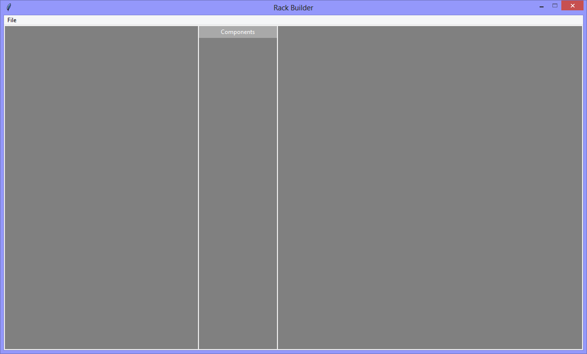

Since 'generic components' of 1U height, in the user interface, their width and
height are the fundemental units of the user interface. Whatever values are assigned
to `generic_component_width` and `generic_component_height` - the widths and heights of
every other object in the user interface is calculated from those values. 

I decided on a width of 150 pixels and a height of 13 pixels because that worked for my
laptop screen. 

I also decided that `tabs_wrapper_width` should be 1/3 of the user interface,
but that may change in future versions.

<p align="center">

</p>

```Python
# ---------- ---------- ---------- ---------- ---------- ---------- ---------- ----------
# Program rack_builder_v1.01_add_wrappers.py
# Written by: Joe Dorward
# Started: 08/10/2024

# This program creates a Tkinter user interface
# * adds the import reference to 'Tk'
# * adds the import reference to 'Menu'
# * adds the menubar_1
# rack_builder_v1.01_add_wrappers
# * adds the import reference to 'Frame'
# * adds the import reference to 'Label'
# * adds the tabs_wrapper
# * adds the components_wrapper
# * adds the racks_wrapper

from tkinter import Tk, Menu, Frame, Label

# ========== ========== ========== ========== ========== ========== ========== ==========
# the offsets are the horizontal and vertical spacing between widgets
x_offset = 2
y_offset = 2

# since 'generic components' are the fundamental objects in the user interface, their width
# and height are the fundemental units of the user interface - the widths and heights of
# every other object in the user interface is calculated from them

generic_component_width = 150
generic_component_height = 13

# UNITS ---------- ---------- ---------- ---------- ----------
# 'unit numbers' are square
unit_font = ('Arial',5,'normal')
unit_number_width = generic_component_height
unit_number_height = generic_component_height

# 'units' are the same size as 'generic components'
unit_width = generic_component_width
unit_height = generic_component_height

# RACKS ---------- ---------- ---------- ---------- ----------
# rack width accommodates a 'unit number' and a 'unit'
# rack height accommodates 42 'units'
rack_label_font = ('Arial',8,'normal')
rack_label_height = 20
rack_width = unit_number_width + unit_width + (3 * x_offset)
rack_height = (unit_height * 42) + (43 * y_offset) + rack_label_height

# GENERIC WRAPPER HEIGHT ---------- ---------- ---------- ---------- ----------
# the 'rack height' defines the height of the 'generic wrapper height'
generic_wrapper_height = rack_height + (2 * x_offset)

tabs_wrapper_height = generic_wrapper_height
components_wrapper_height = generic_wrapper_height
racks_wrapper_height = generic_wrapper_height

# the height of the user interface is calculated from the 'generic wrapper height'
ui_left = x_offset
ui_top = y_offset
ui_height = generic_wrapper_height + (2 * x_offset)
ui_width = (ui_height / 9) * 16 # calculate 16:9 proportional width

# TABS WRAPPER ---------- ---------- ---------- ---------- ----------
tabs_wrapper_left = x_offset
tabs_wrapper_width = ui_width / 3

# COMPONENTS WRAPPER ---------- ---------- ---------- ---------- ----------
component_font = ('Arial',7,'normal')

# inner wrapper (x3)
component_wrapper_label_height = 20
component_wrapper_width = generic_component_width + (2 * x_offset)
component_wrapper_height = int(((components_wrapper_height - component_wrapper_label_height) - (4 * y_offset)) / 3) - 1
print(int(component_wrapper_height))

# outer wrapper (x1)
components_wrapper_label_height = 24
components_wrapper_left = tabs_wrapper_left + tabs_wrapper_width + x_offset
components_wrapper_width = component_wrapper_width + (2 * x_offset)

# switches wrapper
switches_wrapper_width = component_wrapper_width
switches_wrapper_top = components_wrapper_label_height + y_offset

# controllers wrapper
controllers_wrapper_top = switches_wrapper_top + component_wrapper_height + y_offset

# disk shelves wrapper
disk_shelves_wrapper_top = controllers_wrapper_top + component_wrapper_height + y_offset

# RACKS WRAPPER ---------- ---------- ---------- ---------- ----------
racks_wrapper_left = components_wrapper_left + components_wrapper_width + x_offset
racks_wrapper_width = ui_width - tabs_wrapper_width - components_wrapper_width - (4 * x_offset)

# ========== ========== ========== ========== ========== ========== ========== ==========
# MENUBAR
# ========== ========== ========== ========== ========== ========== ========== ==========
def add_Menubar():
    # adds menubar_1
    print("[DEBUG] add_Menubar() called")

    menubar_1 = Menu(ui, name='menubar_1')

    # ---------- ---------- ---------- ---------- ---------- 
    # add file_menu to menubar_1
    file_menu = Menu(menubar_1, name='file_menu')
    menubar_1.add_cascade(menu=file_menu, label='File')
    
    # add options to file_menu
    file_menu.add_command(label='Quit', command=ui.quit)    
    # ---------- ---------- ---------- ---------- ---------- 

    # show menubar_1 in UI
    ui['menu'] = menubar_1
# ========== ========== ========== ========== ========== ========== ========== ==========
# TABS WRAPPER
# ========== ========== ========== ========== ========== ========== ========== ==========
def add_Tabs_Wrapper():
    # adds the tabs_wrapper 
    print("[DEBUG] add_Tabs_Wrapper() called")
   
    global tabs_wrapper
    tabs_wrapper = Frame(ui,
                         background='Gray',
                         name='tabs_wrapper')
    
    tabs_wrapper.place(x=tabs_wrapper_left,
                       y=y_offset,
                       width=tabs_wrapper_width,
                       height=tabs_wrapper_height)
# ========== ========== ========== ========== ========== ========== ========== ==========
# COMPONENTS WRAPPER
# ========== ========== ========== ========== ========== ========== ========== ==========
def add_Components_Wrapper():
    # adds the wrapper 'Frame' widgets
    print("[DEBUG] add_Components_Wrapper() called")

    global components_wrapper
    components_wrapper = Frame(ui,
                               background='Gray',
                               name='components_wrapper')
    
    components_wrapper.place(x=components_wrapper_left,
                             y=y_offset, 
                             width=components_wrapper_width, 
                             height=components_wrapper_height)
# ---------- ---------- ---------- ---------- ---------- ---------- ---------- ----------
def add_Components_Wrapper_Label(parent_widget):
    # adds components_wrapper_label
    print("[DEBUG] add_Components_Wrapper_Label() called")

    components_wrapper_label = Label(components_wrapper,
                                     background='DarkGray',
                                     foreground='white', 
                                     text='Components',
                                     name='components_wrapper_label')
    
    components_wrapper_label.place(x=0,
                                   y=0,
                                   width=components_wrapper_width,
                                   height=components_wrapper_label_height)
# ========== ========== ========== ========== ========== ========== ========== ==========
# RACKS WRAPPER
# ========== ========== ========== ========== ========== ========== ========== ==========
def add_Racks_Wrapper():
    # adds the racks_wrapper
    print("[DEBUG] add_Racks_Wrapper() called")

    global racks_wrapper
    racks_wrapper = Frame(ui,
                          background='Gray',
                          name='racks_wrapper')
    
    racks_wrapper.place(x=racks_wrapper_left,
                        y=y_offset,
                        width=racks_wrapper_width,
                        height=racks_wrapper_height)
# ========== ========== ========== ========== ========== ========== ========== ==========
# UTILLITY FUNCTIONS
# ========== ========== ========== ========== ========== ========== ========== ==========
def list_Child_Widgets(parent_widget):
    # lists the child-widgets of a parent-widget
    print("[DEBUG] list_Child_Widgets() called")

    print("The child-widgets are:")
    for each_child in parent_widget.winfo_children():
        print(" ",each_child.winfo_name())
# MAIN ///// ////////// ////////// ////////// ////////// ////////// ////////// //////////
if __name__ == '__main__':        
    print("----------------------------------------------------")

    # create the 'blank' UI window
    ui = Tk()
    ui.title("Rack Builder")
    ui.geometry('%dx%d+%d+%d' % (ui_width, ui_height, ui_left, ui_top))
    ui.wm_resizable(width=False, height=False)
    ui.option_add('*tearOff', False)

    # add controls
    add_Menubar()
    add_Tabs_Wrapper()
    add_Components_Wrapper()
    add_Components_Wrapper_Label(components_wrapper)
    add_Racks_Wrapper()

    list_Child_Widgets(ui)

    ui.mainloop()
    print("----------------------------------------------------\n")
```
