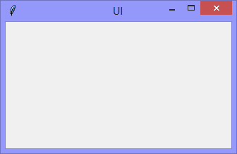

This version of the Tkinter UI is a 'blank' window



The Python code, makes the minimum import reference to `Tk`, and then sizes & positions the 'blank' window.
```Python
# ---------- ---------- ---------- ---------- ---------- ---------- ---------- ----------
# Program ui_v1.01.py
# Written by: Joe Dorward
# Started: 18/09/2024

# This program creates a Tkinter user interface
# * adds the import reference to 'Tk'

from tkinter import Tk

# position the UI window
ui_top = 10
ui_left = 10

# set UI window proportions to 16:9
ui_width = 16 * 20
ui_height = 9 * 20

# MAIN ///// ////////// ////////// ////////// ////////// ////////// ////////// //////////
if __name__ == '__main__':        
    print("----------------------------------------------------")

    # create the 'blank' UI window
    ui = Tk()
    ui.title("UI")
    ui.geometry('%dx%d+%d+%d' % (ui_width, ui_height, ui_left, ui_top))

    ui.mainloop()
    print("----------------------------------------------------\n")
```
