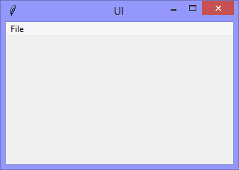

I'm digging more deeply into the use of the Tkinter package (it comes with Python) to create Python applications with 'proper' user interfaces. If you have (or can get) Python installed, you can follow along at home. 
 
Just copy-n-paste each version of the self-contained application as I go, and have fun!
 
This version, adds the **File** menu.



```Python
# ---------- ---------- ---------- ---------- ---------- ---------- ---------- ----------
# Program ui_v1.02_menubar.py
# Written by: Joe Dorward
# Started: 18/09/2024

# This program creates a Tkinter user interface
# * adds the import reference to 'Tk'
# * adds the import reference to 'Menu'
# * adds the menubar_1
# v1.02
# * adds the 'File' menu
# * adds 'Option 1' to the 'File' menu
# * adds the 'stub' handler (method) for 'Option 1'
# * adds 'Quit' option to the 'File' menu

from tkinter import Tk, Menu

# position the UI window
ui_top = 10
ui_left = 10

# set UI window proportions to 16:9
ui_width = 16 * 20
ui_height = 9 * 20
# ---------- ---------- ---------- ---------- ---------- ---------- ---------- ----------
def add_Menubar():
    # adds menubar_1
    print("[DEBUG] Add_Menubar() called")

    menubar_1 = Menu(ui)

    # add 'File' menu
    file_menu = Menu(menubar_1)
    menubar_1.add_cascade(menu=file_menu, label='File')

    # add options to 'File' menu
    file_menu.add_command(label='Option 1', command=stub)
    file_menu.add_command(label='Quit', command=ui.quit)

    # show menubar_1 in UI
    ui['menu'] = menubar_1
# ---------- ---------- ---------- ---------- ---------- ---------- ---------- ----------
def stub():
    # handles any call
    print("[DEBUG] stub() called")

# MAIN ///// ////////// ////////// ////////// ////////// ////////// ////////// //////////
if __name__ == '__main__':        
    print("----------------------------------------------------")

    # create the 'blank' UI window
    ui = Tk()
    ui.title("UI")
    ui.geometry('%dx%d+%d+%d' % (ui_width, ui_height, ui_left, ui_top))
    ui.option_add('*tearOff', False)

    # add controls
    add_Menubar()

    ui.mainloop()
    print("----------------------------------------------------\n")
```
