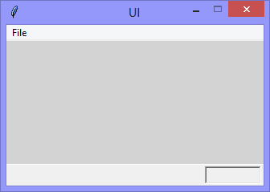

I'm digging more deeply into the use of the Tkinter package (it comes with Python) to create Python applications with 'proper' user interfaces. If you have (or can get) Python installed, you can follow along at home. 
 
Just copy-n-paste each version of the self-contained application as I go, and have fun!
 
This version, adds the import reference to `Label`, from which I create the 'status bar' by styling three labels to create the look and feel of an old-school application status bar. In the development of an user interface, it is often useful to have post-even feedback directly in the user interface - that's what this 'status bar' is for.



```Python
# ---------- ---------- ---------- ---------- ---------- ---------- ---------- ----------
# Program ui_v1.04_status_bar.py
# Written by: Joe Dorward
# Started: 20/09/2024

# This program creates a Tkinter user interface
# * adds the import reference to 'Tk'
# * adds the import reference to 'Menu'
# * adds the menubar_1
# v1.02
# * adds the 'File' menu
# * adds 'Option 1' to the 'File' menu
# * adds the 'stub' handler (method) for 'Option 1'
# * adds 'Quit' option to the 'File' menu
# v1.05_label
# * adds the import reference to 'Label'
# * adds the status_bar_border (1px high highlight)
# * adds the status_bar (the background)
# * adds the option_feedback_label (the 'sunken box')
# * re-purposes 'Option 1' of the 'File' menu
# * adds the handler (method) for 'Option 1'
# * adds 'Option 2' to the 'File' menu
# * adds the handler (method) for 'Option 2'

from tkinter import Tk, Menu, Label

# position the UI window
ui_top = 10
ui_left = 10

# set UI window proportions to 16:9
ui_width = 16 * 20
ui_height = 9 * 20
# ---------- ---------- ---------- ---------- ---------- ---------- ---------- ----------
def add_Menubar():
    # adds menubar_1
    print("[DEBUG] Add_Menubar() called")

    menubar_1 = Menu(ui)

    # add 'File' menu
    file_menu = Menu(menubar_1)
    menubar_1.add_cascade(menu=file_menu, label='File')

    # add options to 'File' menu
    file_menu.add_command(label='Option 1', command=option_1)
    file_menu.add_command(label='Option 2', command=option_2)
    file_menu.add_command(label='Quit', command=ui.quit)

    # show menubar_1 in UI
    ui['menu'] = menubar_1
# ---------- ---------- ---------- ---------- ---------- ---------- ---------- ----------
def add_Status_Bar():
    # adds the status_bar
    print("[DEBUG] add_Status_Bar() called")

    status_bar_width = ui_width
    status_bar_height = 26
    status_bar_left = 0
    status_bar_top = ui_height - status_bar_height

    # status bar border
    status_bar_border = Label(ui, background='#ffffff', name='status_bar_border')
    status_bar_border.place(x=status_bar_left,
                            y=status_bar_top - 1,
                            width=status_bar_width,
                            height=1)

    # status bar
    status_bar = Label(ui, background='#f0f0f0', name='status_bar')
    status_bar.place(x=status_bar_left,
                     y=status_bar_top,
                     width=status_bar_width,
                     height=status_bar_height)
    
    # option feedback label
    option_feedback_label_width = 70
    option_feedback_label_height = status_bar_height - 4
    option_feedback_label_left = status_bar_width - option_feedback_label_width - 5
    option_feedback_label_top = 0

    global option_feedback_label
    option_feedback_label = Label(status_bar, 
                                  foreground='dimgray', 
                                  font=('TkDefaultFont',9), 
                                  relief='sunken', 
                                  name='option_feedback_label')
    option_feedback_label.place(x=option_feedback_label_left, 
                                y=option_feedback_label_top, 
                                width=option_feedback_label_width, 
                                height=option_feedback_label_height)
# ---------- ---------- ---------- ---------- ---------- ---------- ---------- ----------
def option_1():
    # handles 'Option 1' selection
    print("[DEBUG] option_1() called")

    option_feedback_label.config(text='Option 1')
# ---------- ---------- ---------- ---------- ---------- ---------- ---------- ----------
def option_2():
    # handles 'Option 1' selection
    print("[DEBUG] option_2() called")

    option_feedback_label.config(text='Option 2')
# MAIN ///// ////////// ////////// ////////// ////////// ////////// ////////// //////////
if __name__ == '__main__':        
    print("----------------------------------------------------")

    # create the 'blank' UI window
    ui = Tk()
    ui.title("UI")
    ui.config(background='lightgray')
    ui.geometry('%dx%d+%d+%d' % (ui_width, ui_height, ui_left, ui_top))
    ui.wm_resizable(width=False,height=False)
    ui.option_add('*tearOff', False)

    # add controls
    add_Menubar()
    add_Status_Bar()

    ui.mainloop()
    print("----------------------------------------------------\n")
```
