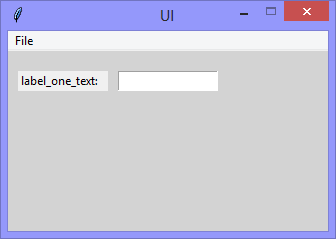

Continuing the exploration of using the Tkinter package with Python, this version adds the
functionality to respond to a 'Tab' or 'Return' keypress within the 'Entry' widget.



```Python
# ---------- ---------- ---------- ---------- ---------- ---------- ---------- ----------
# Program ui_v1.05_label_entry_keypress.py
# Written by: Joe Dorward
# Started: 23/09/2024

# This program creates a Tkinter user interface
# * adds the import reference to 'Tk'
# * adds the import reference to 'Menu'
# * adds the menubar_1
# v1.05_label_and_entry_and_keypress
# * binds entry_one to the <Key> (keypress) event - and  that keypress handler (method)
# * adds handler (method) to handle 'Tab' & 'Return' keypresses in entry_one

from tkinter import Tk, Menu, Label, StringVar, Entry

# position the UI window
ui_top = 10
ui_left = 10

# set UI window proportions to 16:9
ui_width = 16 * 20
ui_height = 9 * 20
# ---------- ---------- ---------- ---------- ---------- ---------- ---------- ----------
def add_Menubar():
    # adds menubar_1
    print("[DEBUG] Add_Menubar() called")

    menubar_1 = Menu(ui)

    # add 'File' menu
    file_menu = Menu(menubar_1)
    menubar_1.add_cascade(menu=file_menu, label='File')

    # add options to 'File' menu
    file_menu.add_command(label='Print entry_one', command=print_Entry_One)
    file_menu.add_command(label='Quit', command=ui.quit)

    # show menubar_1 in UI
    ui['menu'] = menubar_1
# ---------- ---------- ---------- ---------- ---------- ---------- ---------- ----------
def add_Label_One():
    # adds the label_one
    print("[DEBUG] add_Label_One() called")

    label_one_left = 10
    label_one_top = 20
    label_one_width = 90
    label_one_height = 20

    # label one
    label_one = Label(ui, anchor='w', text="label_one_text:", name='label_one')
    label_one.place(x=label_one_left,
                    y=label_one_top,
                    width=label_one_width,
                    height=label_one_height)
# ---------- ---------- ---------- ---------- ---------- ---------- ---------- ----------
def add_Entry_One():
    # adds the entry_one
    print("[DEBUG] add_Entry_One() called")

    entry_one_left = 110
    entry_one_top = 20
    entry_one_width = 100
    entry_one_height = 20

    # entry one string variable
    global entry_one_string_variable
    entry_one_string_variable = StringVar(ui)

    # entry one
    entry_one = Entry(ui, textvariable=entry_one_string_variable, name='entry_one')
    entry_one.place(x=entry_one_left,
                    y=entry_one_top,
                    width=entry_one_width,
                    height=entry_one_height)    

    entry_one.focus_set()    
    entry_one.bind("<Key>", entry_One_Keypress_Handler)
# ---------- ---------- ---------- ---------- ---------- ---------- ---------- ----------
def print_Entry_One():
    # prints the value of entry_one
    print("[DEBUG] print_Entry_One() called")

    print("The value of 'entry_one' is:",entry_one_string_variable.get())
# ---------- ---------- ---------- ---------- ---------- ---------- ---------- ----------
def entry_One_Keypress_Handler(event):
    # handles an entry_one <Key> event
    print("[DEBUG] entry_One_Keypress_Handler() called")

    if (event.keysym == "Tab"):
        print("The 'Tab' key was pressed")

    elif  (event.keysym == "Return"):
        print("The 'Return' key was pressed")
# MAIN ///// ////////// ////////// ////////// ////////// ////////// ////////// //////////
if __name__ == '__main__':        
    print("----------------------------------------------------")

    # create the 'blank' UI window
    ui = Tk()
    ui.title("UI")
    ui.config(background='lightgray')
    ui.geometry('%dx%d+%d+%d' % (ui_width, ui_height, ui_left, ui_top))
    ui.wm_resizable(width=False, height=False)
    ui.option_add('*tearOff', False)

    # add controls
    add_Menubar()
    add_Label_One()
    add_Entry_One()

    ui.mainloop()
    print("----------------------------------------------------\n")
    ```
