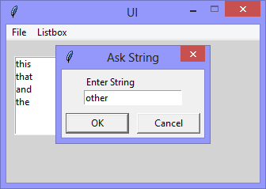

Continuing the exploration of using Tkinter with Python, this version adds a 'Listbox' widget,
and the functionality to add strings to it.



```Python
# ---------- ---------- ---------- ---------- ---------- ---------- ---------- ----------
# Program ui_v1.06_askstring_listbox.py
# Written by: Joe Dorward
# Started: 26/09/2024

# This program creates a Tkinter user interface
# * adds the import reference to 'Tk'
# * adds the import reference to 'Menu'
# * adds the menubar_1
# v1.06_askstring_listbox
# * adds the import reference to 'Listbox'
# * adds the import reference to 'simpledialog' 
# * adds string_listbox
# * adds listbox_menu to menubar_1
# * adds ask_String option to listbox_menu
# * adds handler (method) to handle the ask_String option

from tkinter import Tk, Menu, Listbox, simpledialog

# position the UI window
ui_top = 10
ui_left = 10

# set UI window proportions to 16:9
ui_width = 16 * 20
ui_height = 9 * 20
# ---------- ---------- ---------- ---------- ---------- ---------- ---------- ----------
def add_Menubar():
    # adds menubar_1
    print("[DEBUG] Add_Menubar() called")

    menubar_1 = Menu(ui)

    # add 'File' menu
    file_menu = Menu(menubar_1)
    menubar_1.add_cascade(menu=file_menu, label='File')

    # add options to 'File' menu
    file_menu.add_command(label='Quit', command=ui.quit)

    # add 'Listbox' menu
    listbox_menu = Menu(menubar_1)
    menubar_1.add_cascade(menu=listbox_menu, label='Listbox')
    listbox_menu.add_command(label='Ask String', command=ask_String)

    # show menubar_1 in UI
    ui['menu'] = menubar_1
# ---------- ---------- ---------- ---------- ---------- ---------- ---------- ----------
def add_String_Listbox():
    # adds string_listbox
    print("[DEBUG] Add_String_Listbox() called")

    string_listbox_left = 10
    string_listbox_top = 20
    string_listbox_width = 100
    string_listbox_height = 100

    global string_listbox
    string_listbox = Listbox(ui, name='string_listbox')
    string_listbox.place(x=string_listbox_left,
                         y=string_listbox_top,
                         width=string_listbox_width, 
                         height=string_listbox_height)
# ---------- ---------- ---------- ---------- ---------- ---------- ---------- ----------
def ask_String():
    # adds menubar_1
    print("[DEBUG] ask_String() called")

    string = simpledialog.askstring(parent=ui, title="Ask String", prompt="Enter String")

    # string_listbox.size() is the number of items in string_listbox
    # string_listbox.size() is 0 when empty, and 1 after the first item is inserted
    # so, when inserting the first item into string_listbox, the value of:
    # * string_listbox.size() will be 0
    # * insert_at should be 1
 
    insert_at = string_listbox.size() + 1
    string_listbox.insert(insert_at, string)
# MAIN ///// ////////// ////////// ////////// ////////// ////////// ////////// //////////
if __name__ == '__main__':        
    print("----------------------------------------------------")

    # create the 'blank' UI window
    ui = Tk()
    ui.title("UI")
    ui.config(background='lightgray')
    ui.geometry('%dx%d+%d+%d' % (ui_width, ui_height, ui_left, ui_top))
    ui.wm_resizable(width=False, height=False)
    ui.option_add('*tearOff', False)

    # add controls
    add_Menubar()
    add_String_Listbox()

    ui.mainloop()
    print("----------------------------------------------------\n")
```
