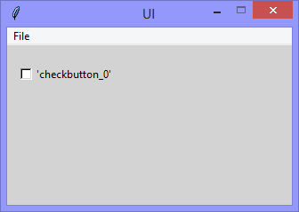
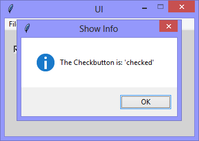

Continuing the exploration of using Tkinter with Python, this version adds
a 'Checkbutton' (the Tkinter name for a Checkbox), and
the functionality to raise a 'showinfo' messagebox when the checkbutton is checked / unchecked.

|||
|-|-|
|||

```Python
# ---------- ---------- ---------- ---------- ---------- ---------- ---------- ----------
# Program ui_v1.08_showinfo_checkbutton.py
# Written by: Joe Dorward
# Started: 27/09/2024

# This program creates a Tkinter user interface
# * adds the import reference to 'Tk'
# * adds the import reference to 'Menu'
# * adds the menubar_1
# ui_v1.08_showinfo_checkbutton
# * adds the import reference to 'Checkbutton'
# * adds the import reference to 'IntVar'
# * adds handler (method) to handle the checking / unchecking

from tkinter import Tk, Menu, messagebox as showinfo_1, Checkbutton, IntVar

# position the UI window
ui_top = 10
ui_left = 10

# set UI window proportions to 16:9
ui_width = 16 * 20
ui_height = 9 * 20
# ---------- ---------- ---------- ---------- ---------- ---------- ---------- ----------
def add_Menubar():
    # adds menubar_1
    print("[DEBUG] Add_Menubar() called")

    menubar_1 = Menu(ui)

    # add 'File' menu
    file_menu = Menu(menubar_1)
    menubar_1.add_cascade(menu=file_menu, label='File')
    file_menu.add_command(label='Quit', command=ui.quit)

    # show menubar_1 in UI
    ui['menu'] = menubar_1
# ---------- ---------- ---------- ---------- ---------- ---------- ---------- ----------
def add_Checkbutton_0():
    # adds checkbutton_0
    print("\n[DEBUG] Add_Checkbutton_0() called")

    checkbutton_0_left = 10
    checkbutton_0_top = 20

    global checkbutton_0_variable
    checkbutton_0_variable = IntVar(ui)
    checkbutton_0_variable.set('0')

    checkbutton_0 = Checkbutton(ui, 
                                background="lightgray", 
                                text="'checkbutton_0'", 
                                variable=checkbutton_0_variable,
                                onvalue=1,
                                offvalue=0,
                                command=show_Info)
    checkbutton_0.place(x=checkbutton_0_left, y=checkbutton_0_top)
# ---------- ---------- ---------- ---------- ---------- ---------- ---------- ----------
def show_Info():
    # raises the showinfo_1 messagebox
    print("[DEBUG] show_Info() called")

    checked_state = 'unchecked'
    if (checkbutton_0_variable.get() == 1):
        checked_state = 'checked'

    showinfo_1.showinfo(title="Show Info",
                        message="The Checkbutton is: '{}'".format(checked_state))
# MAIN ///// ////////// ////////// ////////// ////////// ////////// ////////// //////////
if __name__ == '__main__':        
    print("----------------------------------------------------")

    # create the 'blank' UI window
    ui = Tk()
    ui.title("UI")
    ui.config(background='lightgray')
    ui.geometry('%dx%d+%d+%d' % (ui_width, ui_height, ui_left, ui_top))
    ui.wm_resizable(width=False, height=False)
    ui.option_add('*tearOff', False)

    # add controls
    add_Menubar()
    add_Checkbutton_0()

    ui.mainloop()
    print("----------------------------------------------------\n")
```
