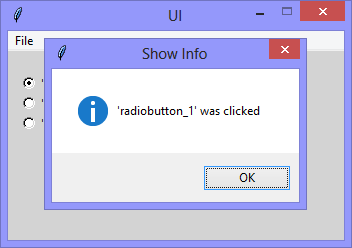

Continuing the exploration of using Tkinter with Python, this version adds
three 'Radiobutton' widgets, and the functionality to raise a 'showinfo' messagebox when
those radiobutton are clicked.

|||
|-|-|
|this||

```Python
# ---------- ---------- ---------- ---------- ---------- ---------- ---------- ----------
# Program ui_v1.09_showinfo_radiobutton.py
# Written by: Joe Dorward
# Started: 28/09/2024

# This program creates a Tkinter user interface
# * adds the import reference to 'Tk'
# * adds the import reference to 'Menu'
# * adds the menubar_1
# ui_v1.09_showinfo_radiobutton
# * adds the import reference to 'Radiobutton'
# * adds three radiobuttons
# * binds the radiobutton_variable to each radiobutton
# * adds handler (method) to handle the checking / unchecking

from tkinter import Tk, Menu, messagebox as showinfo_1, Radiobutton, IntVar

# position the UI window
ui_top = 10
ui_left = 10

# set UI window proportions to 16:9
ui_width = 16 * 21
ui_height = 9 * 21
# ---------- ---------- ---------- ---------- ---------- ---------- ---------- ----------
def add_Menubar():
    # adds menubar_1
    print("[DEBUG] Add_Menubar() called")

    menubar_1 = Menu(ui)

    # add 'File' menu
    file_menu = Menu(menubar_1)
    menubar_1.add_cascade(menu=file_menu, label='File')
    file_menu.add_command(label='Quit', command=ui.quit)

    # show menubar_1 in UI
    ui['menu'] = menubar_1
# ---------- ---------- ---------- ---------- ---------- ---------- ---------- ----------
def add_Radiobuttons():
    # adds three radiobuttons
    print("\n[DEBUG] add_Radiobuttons() called")

    radiobutton_left = 10
    radiobutton_top = 20

    global radiobutton_variable
    radiobutton_variable = IntVar(ui)

    # radiobutton 1
    radiobutton_1 = Radiobutton(ui, 
                                background="lightgray", 
                                text="'radiobutton_1'", 
                                variable=radiobutton_variable,
                                value=1,
                                command=show_Info)
    radiobutton_1.place(x=radiobutton_left, y=radiobutton_top)

    # radiobutton 2
    radiobutton_top += 20
    radiobutton_2 = Radiobutton(ui, 
                                background="lightgray", 
                                text="'radiobutton_2'", 
                                variable=radiobutton_variable,
                                value=2,
                                command=show_Info)
    radiobutton_2.place(x=radiobutton_left, y=radiobutton_top)

    # radiobutton 3
    radiobutton_top += 20
    radiobutton_3 = Radiobutton(ui, 
                                background="lightgray", 
                                text="'radiobutton_3'", 
                                variable=radiobutton_variable,
                                value=3,
                                command=show_Info)
    radiobutton_3.place(x=radiobutton_left, y=radiobutton_top)
# ---------- ---------- ---------- ---------- ---------- ---------- ---------- ----------
def show_Info():
    # raises the showinfo_1 messagebox
    print("[DEBUG] show_Info() called")

    if (radiobutton_variable.get() == 1):
        showinfo_1.showinfo(title="Show Info",
                            message="'radiobutton_1' was clicked")
        
    elif (radiobutton_variable.get() == 2):
        showinfo_1.showinfo(title="Show Info",
                            message="'radiobutton_2' was clicked")
        
    elif (radiobutton_variable.get() == 3):
        showinfo_1.showinfo(title="Show Info",
                            message="'radiobutton_3' was clicked")
# MAIN ///// ////////// ////////// ////////// ////////// ////////// ////////// //////////
if __name__ == '__main__':        
    print("----------------------------------------------------")

    # create the 'blank' UI window
    ui = Tk()
    ui.title("UI")
    ui.config(background='lightgray')
    ui.geometry('%dx%d+%d+%d' % (ui_width, ui_height, ui_left, ui_top))
    ui.wm_resizable(width=False, height=False)
    ui.option_add('*tearOff', False)

    # add controls
    add_Menubar()
    add_Radiobuttons()

    ui.mainloop()
    print("----------------------------------------------------\n")
```
