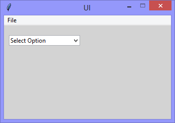
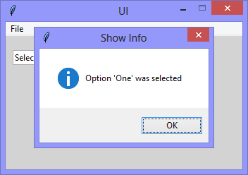

Continuing the exploration of using Tkinter with Python, this version adds
a 'Combobox' widget, and the functionality to raise a 'showinfo' messagebox when
the options of the combobox are clicked.

|||
|-|-|
|||

```Python
# ---------- ---------- ---------- ---------- ---------- ---------- ---------- ----------
# Program ui_v1.10_showinfo_combobox.py
# Written by: Joe Dorward
# Started: 29/09/2024

# This program creates a Tkinter user interface
# * adds the import reference to 'Tk'
# * adds the import reference to 'Menu'
# * adds the menubar_1
# ui_v1.10_showinfo_combobox
# * adds the import reference to 'StringVar'
# * adds the import reference to 'ttk' for 'Combobox'
# * binds combobox_1 to the <<ComboboxSelected>> event and handler (method)

from tkinter import Tk, Menu, messagebox as showinfo_1, StringVar, ttk

# position the UI window
ui_top = 10
ui_left = 10

# set UI window proportions to 16:9
ui_width = 16 * 21
ui_height = 9 * 21
# ---------- ---------- ---------- ---------- ---------- ---------- ---------- ----------
def add_Menubar():
    # adds menubar_1
    print("[DEBUG] Add_Menubar() called")

    menubar_1 = Menu(ui)

    # ---------- ---------- ---------- ---------- ---------- 
    # add file_menu to menubar_1
    file_menu = Menu(menubar_1)
    menubar_1.add_cascade(menu=file_menu, label='File')
    
    # add options to file_menu
    file_menu.add_command(label='Quit', command=ui.quit)    
    # ---------- ---------- ---------- ---------- ---------- 

    # show menubar_1 in UI
    ui['menu'] = menubar_1
# ---------- ---------- ---------- ---------- ---------- ---------- ---------- ----------
def add_Combobox():
    # adds combobox
    print("\n[DEBUG] Add_Combobox() called")

    combobox_1_left = 10
    combobox_1_top = 20

    global combobox_1_variable
    combobox_1_variable = StringVar(ui)

    combobox_1 = ttk.Combobox(ui,
                              textvariable=combobox_1_variable)
    combobox_1.place(x=combobox_1_left, y=combobox_1_top)

    # add combobox options
    combobox_1['values'] = ('Select Option','One','Two','Three')
    combobox_1.set('Select Option')

    combobox_1.bind("<<ComboboxSelected>>",Combobox_1_Selection_Handler)
# ---------- ---------- ---------- ---------- ---------- ---------- ---------- ----------
def Combobox_1_Selection_Handler(event):
    # handles combobox_1 <<ComboboxSelected>> event
    print("[DEBUG] Combobox_1_Selection_Handler() called")

    if (combobox_1_variable.get() == 'One'):
        showinfo_1.showinfo(title="Show Info",
                            message="Option 'One' was selected")
        
    elif (combobox_1_variable.get() == 'Two'):
        showinfo_1.showinfo(title="Show Info",
                            message="Option 'Two' was selected")
        
    elif (combobox_1_variable.get() == 'Three'):
        showinfo_1.showinfo(title="Show Info",
                            message="Option 'Three' was selected")
# MAIN ///// ////////// ////////// ////////// ////////// ////////// ////////// //////////
if __name__ == '__main__':        
    print("----------------------------------------------------")

    # create the 'blank' UI window
    ui = Tk()
    ui.title("UI")
    ui.config(background='lightgray')
    ui.geometry('%dx%d+%d+%d' % (ui_width, ui_height, ui_left, ui_top))
    ui.wm_resizable(width=False, height=False)
    ui.option_add('*tearOff', False)

    # add controls
    add_Menubar()
    add_Combobox()

    ui.mainloop()
    print("----------------------------------------------------\n")
```
