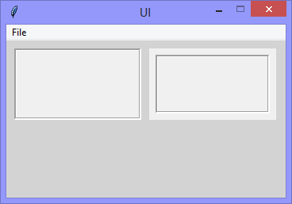

Continuing the exploration of using Tkinter with Python, this version adds
'Frame' widgets with their 'relief' attribute set to 'groove'.
The second example has its 'highlightthickness' attribute set to '8'.



```Python
# ---------- ---------- ---------- ---------- ---------- ---------- ---------- ----------
# Program ui_v1.11_groove_frames.py
# Written by: Joe Dorward
# Started: 30/09/2024

# This program creates a Tkinter user interface
# * adds the import reference to 'Tk'
# * adds the import reference to 'Menu'
# * adds the menubar_1
# ui_v1.11_groove_frames
# * adds the import reference to 'Frame'

from tkinter import Tk, Menu, Frame

# position the UI window
ui_top = 10
ui_left = 10

# set UI window proportions to 16:9
ui_width = 16 * 22
ui_height = 9 * 22
# ---------- ---------- ---------- ---------- ---------- ---------- ---------- ----------
def add_Menubar():
    # adds menubar_1
    print("[DEBUG] add_Menubar() called")

    menubar_1 = Menu(ui)

    # ---------- ---------- ---------- ---------- ---------- 
    # add file_menu to menubar_1
    file_menu = Menu(menubar_1)
    menubar_1.add_cascade(menu=file_menu, label='File')
    
    # add options to file_menu
    file_menu.add_command(label='Quit', command=ui.quit)    
    # ---------- ---------- ---------- ---------- ---------- 

    # show menubar_1 in UI
    ui['menu'] = menubar_1
# ---------- ---------- ---------- ---------- ---------- ---------- ---------- ----------
def add_Groove_Frames():
    # adds 'groove' frames
    print("[DEBUG] add_Groove_Frames() called")

    x_offset = 10
    y_offset = 10

    frame_width = 16 * 10
    frame_height = 9 * 10

    border_width = 3
    # ---------- ---------- ---------- ---------- ---------- 
    # groove_frame_1
    frame_left = x_offset
    frame_top = y_offset

    groove_frame_1 = Frame(ui,
                           borderwidth=border_width,
                           relief='groove',
                           name="groove_frame_1")
    
    groove_frame_1.place(x=frame_left,
                         y=frame_top,
                         width=frame_width,
                         height=frame_height)
    # ---------- ---------- ---------- ---------- ---------- 
    # groove_frame_2
    frame_left = (2 * x_offset) + frame_width

    groove_frame_2 = Frame(ui,
                           borderwidth=border_width,
                           relief='groove',
                           background='lightgray',
                           highlightthickness=8,
                           name="groove_frame_2")
    
    groove_frame_2.place(x=frame_left,
                         y=frame_top,
                         width=frame_width,
                         height=frame_height)
# MAIN ///// ////////// ////////// ////////// ////////// ////////// ////////// //////////
if __name__ == '__main__':        
    print("----------------------------------------------------")

    # create the 'blank' UI window
    ui = Tk()
    ui.title("UI")
    ui.config(background='lightgray')
    ui.geometry('%dx%d+%d+%d' % (ui_width, ui_height, ui_left, ui_top))
    ui.wm_resizable(width=False, height=False)
    ui.option_add('*tearOff', False)

    # add controls
    add_Menubar()
    add_Groove_Frames()

    ui.mainloop()
    print("----------------------------------------------------\n")
```
