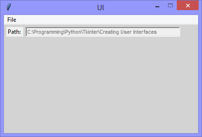

Continuing the exploration of using Tkinter with Python, this version adds
'Label' widgets (one with its 'relief' attribute set to 'sunken') and 'on start-up'
assigns its 'text' attribute to the current working directory of the application.



```Python
# ---------- ---------- ---------- ---------- ---------- ---------- ---------- ----------
# Program ui_v1.13_get_path.py
# Written by: Joe Dorward
# Started: 03/10/2024

# This program creates a Tkinter user interface
# * adds the import reference to 'Tk'
# * adds the import reference to 'Menu'
# * adds the menubar_1
# ui_v1.13_get_path
# * adds the import reference to 'Label'
# * adds the import reference to 'os'

from tkinter import Tk, Menu, Label
import os

# position the UI window
ui_top = 10
ui_left = 10

# set UI window proportions to 16:9
ui_width = 16 * 25
ui_height = 9 * 25
# ---------- ---------- ---------- ---------- ---------- ---------- ---------- ----------
def add_Menubar():
    # adds menubar_1
    print("[DEBUG] add_Menubar() called")

    menubar_1 = Menu(ui)

    # ---------- ---------- ---------- ---------- ---------- 
    # add file_menu to menubar_1
    file_menu = Menu(menubar_1)
    menubar_1.add_cascade(menu=file_menu, label='File')
    
    # add options to file_menu
    file_menu.add_command(label='Quit', command=ui.quit)    
    # ---------- ---------- ---------- ---------- ---------- 

    # show menubar_1 in UI
    ui['menu'] = menubar_1
# ---------- ---------- ---------- ---------- ---------- ---------- ---------- ----------
def add_Path_Label_One():
    # adds path_label_one
    print("[DEBUG] add_Path_Label_One() called")

    path_label_one_left = 5
    path_label_one_top = 5
    path_label_one_width = 35
    path_label_one_height = 20

    path_label_one = Label(ui, text="Path:", anchor='w', name='label_one')
    path_label_one.place(x=path_label_one_left,
                         y=path_label_one_top,
                         width=path_label_one_width,
                         height=path_label_one_height)
# ---------- ---------- ---------- ---------- ---------- ---------- ---------- ----------
def add_Path_Label_Two():
    # adds path_label_two
    print("[DEBUG] add_Path_Label_Two() called")

    path_label_two_left = 45
    path_label_two_top = 5
    path_label_two_width = ui_width - path_label_two_left - 37
    path_label_two_height = 20
    
    path = os.getcwd()

    path_label_two = Label(ui,
                           text=path,
                           foreground='dimgray', 
                           font=('TkDefaultFont',8), 
                           relief='sunken',
                           anchor='w',
                           name='path_label_two')
    
    path_label_two.place(x=path_label_two_left,
                         y=path_label_two_top,
                         width=path_label_two_width,
                         height=path_label_two_height)
# MAIN ///// ////////// ////////// ////////// ////////// ////////// ////////// //////////
if __name__ == '__main__':        
    print("----------------------------------------------------")

    # create the 'blank' UI window
    ui = Tk()
    ui.title("UI")
    ui.config(background='lightgray')
    ui.geometry('%dx%d+%d+%d' % (ui_width, ui_height, ui_left, ui_top))
    ui.wm_resizable(width=False, height=False)
    ui.option_add('*tearOff', False)

    # add controls
    add_Menubar()
    add_Path_Label_One()
    add_Path_Label_Two()

    ui.mainloop()
    print("----------------------------------------------------\n")
```
