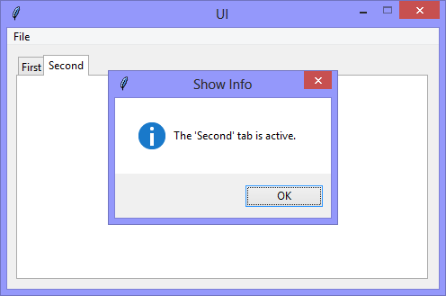

Continuing the exploration of using Tkinter with Python, this version adds a
'Notebook' widget

|||
|-|-|
|||

```Python
# ---------- ---------- ---------- ---------- ---------- ---------- ---------- ----------
# Program ui_v1.15_notebook_showinfo.py
# Written by: Joe Dorward
# Started: 01/10/2024

# This program creates a Tkinter user interface
# * adds the import reference to 'Tk'
# * adds the import reference to 'Menu'
# * adds the menubar_1
# ui_v1.15_notebook_showinfo
# * adds the import reference to 'Frame'
# * adds the import reference to 'ttk'
# * adds the import reference to 'messagebox'
# * adds notebook_1, the 'parent' widget
# * adds page_1 & page_2, the actual 'tabs'
# * binds notebook_1 to the <<NotebookTabChanged>> event and handler (method)

from tkinter import Tk, Menu, Frame, ttk # 'ttk' for 'Notebook' widget
from tkinter import messagebox as showinfo_1

# position the UI window
ui_top = 10
ui_left = 10

# set UI window proportions to 16:9
ui_width = 16 * 30
ui_height = 9 * 30
# ---------- ---------- ---------- ---------- ---------- ---------- ---------- ----------
def add_Menubar():
    # adds menubar_1
    print("[DEBUG] add_Menubar() called")

    menubar_1 = Menu(ui)

    # ---------- ---------- ---------- ---------- ---------- 
    # add file_menu to menubar_1
    file_menu = Menu(menubar_1)
    menubar_1.add_cascade(menu=file_menu, label='File')
    
    # add options to file_menu
    file_menu.add_command(label='Quit', command=ui.quit)    
    # ---------- ---------- ---------- ---------- ---------- 

    # show menubar_1 in UI
    ui['menu'] = menubar_1

# ---------- ---------- ---------- ---------- ---------- ---------- ---------- ----------
def add_Notebook():
    # adds notebook_1
    print("[DEBUG] add_Notebook() called")

    notebook_1_width = ui_width
    notebook_1_height = ui_height
    notebook_1_left = 0
    notebook_1_top = 0

    # add notebook_1
    global notebook_1
    notebook_1 = ttk.Notebook(ui, name='notebook_1')
    notebook_1.config(padding=10)
    notebook_1.place(x=notebook_1_left,
                     y=notebook_1_top,
                     width=notebook_1_width,
                     height=notebook_1_height)

    # add page_1
    page_1 = Frame(notebook_1, background='white', name='page_1')
    notebook_1.add(page_1, text='First')

    # add page_2
    page_2 = Frame(notebook_1, background='white', name='page_2')
    notebook_1.add(page_2, text='Second')

    notebook_1.bind("<<NotebookTabChanged>>",notebook_Tab_Changed)
# ---------- ---------- ---------- ---------- ---------- ---------- ---------- ----------
def notebook_Tab_Changed(event):
    # handles notebook tab changes
    print("[DEBUG] Notebook_Tab_Changed() called")
 
    tab_name = notebook_1.select()
    tab_index = notebook_1.index(tab_name)
    tab_text = notebook_1.tab(tab_index)['text']

    print("The value of 'tab_name' is:", tab_name)
    print("The value of 'tab_index' is:", tab_index)
    print("The value of 'tab_text' is:", tab_text)

    showinfo_1.showinfo(title="Show Info",
                        message="The '{}' tab is active.".format(tab_text))
# MAIN ///// ////////// ////////// ////////// ////////// ////////// ////////// //////////
if __name__ == '__main__':        
    print("----------------------------------------------------")

    # create the 'blank' UI window
    ui = Tk()
    ui.title("UI")
    ui.config(background='lightgray')
    ui.geometry('%dx%d+%d+%d' % (ui_width, ui_height, ui_left, ui_top))
    ui.wm_resizable(width=False, height=False)
    ui.option_add('*tearOff', False)

    # add controls
    add_Menubar()
    add_Notebook() 

    ui.mainloop()
    print("----------------------------------------------------\n")
```
