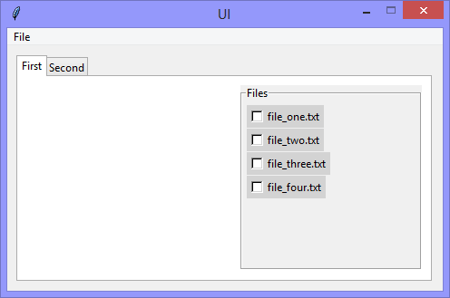

Continuing the exploration of using Tkinter with Python, this version adds
(to a 'Notebook' widget) a dynamically created list of 'Checkbutton'
(the Tkinter name for a Checkbox) widgets, by 'reading' a hard-coded
list filenames. In doing so, it uses the filenames as the label-text for each
'Checkbutton' widget.



```Python
# ---------- ---------- ---------- ---------- ---------- ---------- ---------- ----------
# Program ui_v1.16_notebook_labelframe_checkbutton_list.py
# Written by: Joe Dorward
# Started: 05/10/2024

# This program creates a Tkinter user interface
# * adds the import reference to 'Tk'
# * adds the import reference to 'Menu'
# * adds the menubar_1
# ui_v1.16_notebook_labelframe_checkbutton_list
# * adds the import reference to 'LabelFrame'
# * adds the import reference to 'Checkbutton'
# NOTE
# Although the filelist is hard-coded for convenience, the 'real'
# implementation of this application would create the filelist from the
# files it 'sees' in a directory
filelist = ["file_one.txt", "file_two.txt", "file_three.txt", "file_four.txt"]

from tkinter import Tk, Menu, Frame, ttk # 'ttk' for 'Notebook' widget
from tkinter import LabelFrame, Checkbutton

# position the UI window
ui_top = 10
ui_left = 10

# set UI window proportions to 16:9
ui_width = 16 * 30
ui_height = 9 * 30

# ---------- ---------- ---------- ---------- ---------- ---------- ---------- ----------
def add_Menubar():
    # adds menubar_1
    print("[DEBUG] add_Menubar() called")

    menubar_1 = Menu(ui)

    # ---------- ---------- ---------- ---------- ---------- 
    # add file_menu to menubar_1
    file_menu = Menu(menubar_1)
    menubar_1.add_cascade(menu=file_menu, label='File')
    
    # add options to file_menu
    file_menu.add_command(label='Quit', command=ui.quit)    
    # ---------- ---------- ---------- ---------- ---------- 

    # show menubar_1 in UI
    ui['menu'] = menubar_1
# ---------- ---------- ---------- ---------- ---------- ---------- ---------- ----------
def add_Notebook():
    # adds notebook_1
    print("[DEBUG] add_Notebook() called")

    notebook_1_width = ui_width
    notebook_1_height = ui_height
    notebook_1_left = 0
    notebook_1_top = 0

    # add notebook_1
    global notebook_1
    notebook_1 = ttk.Notebook(ui, name='notebook_1')
    notebook_1.config(padding=10)
    notebook_1.place(x=notebook_1_left,
                     y=notebook_1_top,
                     width=notebook_1_width,
                     height=notebook_1_height)
    # ---------- ---------- ---------- ---------- ----------
    # add page_1
    page_1 = Frame(notebook_1, background='white', name='page_1')
    notebook_1.add(page_1, text='First')

    add_Filelist(page_1, notebook_1_width, notebook_1_height)
    # ---------- ---------- ---------- ---------- ----------
    # add page_2
    page_2 = Frame(notebook_1, background='white', name='page_2')
    notebook_1.add(page_2, text='Second')
# ---------- ---------- ---------- ---------- ---------- ---------- ---------- ----------
def add_Filelist(parent_widget, parent_widget_width, parent_widget_height):
    # adds filelist
    print("[DEBUG] add_Filelist() called")

    filelist_width = 200
    filelist_left = parent_widget_width - filelist_width - 34
    filelist_height = parent_widget_height - 66

    filelist = LabelFrame(parent_widget,text='Files')
    filelist.place(x=filelist_left,
                    y=10,
                    width=filelist_width, 
                    height=filelist_height)

    add_Checkbuttons(filelist)
# ---------- ---------- ---------- ---------- ---------- ---------- ---------- ----------
def add_Checkbuttons(parent_widget):
    # adds the checkbuttons

    # get the number of files in the list
    file_count = len(filelist)

    for filelist_index in range(file_count):
        checkbutton_top = 5 + (26 * filelist_index)
        checkbutton = Checkbutton(parent_widget,
                                  background='lightgray',
                                  text=filelist[filelist_index])
        
        checkbutton.place(x=5,
                          y=checkbutton_top)
# MAIN ///// ////////// ////////// ////////// ////////// ////////// ////////// //////////
if __name__ == '__main__':        
    print("----------------------------------------------------")

    # create the 'blank' UI window
    ui = Tk()
    ui.title("UI")
    ui.config(background='lightgray')
    ui.geometry('%dx%d+%d+%d' % (ui_width, ui_height, ui_left, ui_top))
    ui.wm_resizable(width=False, height=False)
    ui.option_add('*tearOff', False)

    # add controls
    add_Menubar()
    add_Notebook() 

    ui.mainloop()
    print("----------------------------------------------------\n")
```
