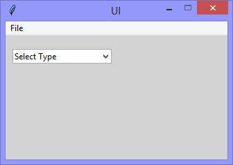

Continuing the exploration of using Tkinter with Python, this version adds
the functionality to populate the options of a 'Combobox' widget by parsing
XML data from a file:

```xml
<?xml version="1.0" encoding="UTF-8"?>
<component-types>
    <type>Controller</type>    
    <type>Disk Shelf</type>
    <type>Switch</type>
</component-types>
```
|||
|-|-|
|||

```Python
# ---------- ---------- ---------- ---------- ---------- ---------- ---------- ----------
# Program ui_v1.18_combobox.component_types_xml
# Written by: Joe Dorward
# Started: 08/10/2024

# This program creates a Tkinter user interface
# * adds the import reference to 'Tk'
# * adds the import reference to 'Menu'
# * adds the menubar_1
# ui_v1.18_combobox.component_types_xml
# * adds the import reference to 'messagebox'
# * adds the import reference to 'StringVar'
# * adds the import reference to 'ttk' for 'Combobox'
# * adds the import reference to 'os'
# * adds the import reference to 'xml.dom.minidom'

from tkinter import Tk, Menu, messagebox as showinfo_1, StringVar, ttk 
import os
import xml.dom.minidom

# position the UI window
ui_top = 10
ui_left = 10

# set UI window proportions to 16:9
ui_width = 16 * 20
ui_height = 9 * 20

types_list = []
# ---------- ---------- ---------- ---------- ---------- ---------- ---------- ----------
def add_Menubar():
    # adds menubar_1
    print("[DEBUG] add_Menubar() called")

    menubar_1 = Menu(ui)

    # ---------- ---------- ---------- ---------- ---------- 
    # add file_menu to menubar_1
    file_menu = Menu(menubar_1)
    menubar_1.add_cascade(menu=file_menu, label='File')
    
    # add options to file_menu
    file_menu.add_command(label='Quit', command=ui.quit)    
    # ---------- ---------- ---------- ---------- ---------- 

    # show menubar_1 in UI
    ui['menu'] = menubar_1
# ---------- ---------- ---------- ---------- ---------- ---------- ---------- ----------
def add_Combobox_1():
    # adds combobox_1
    print("\n[DEBUG] add_Combobox_1() called")

    combobox_1_left = 10
    combobox_1_top = 20

    global combobox_1_variable
    combobox_1_variable = StringVar(ui)

    global combobox_1
    combobox_1 = ttk.Combobox(ui, textvariable=combobox_1_variable)
    combobox_1.place(x=combobox_1_left, y=combobox_1_top)

    combobox_1.set('Select Type')
    combobox_1.bind("<<ComboboxSelected>>",Combobox_1_Selection_Handler)
# ---------- ---------- ---------- ---------- ---------- ---------- ---------- ----------
def parse_XML():
    # parses XML to types_list
    print("[DEBUG] parse_XML() called")

    # get path to file
    path_to_file = os.getcwd() + "\\combobox.component_types.xml"

    # parse file
    component_types = xml.dom.minidom.parse(path_to_file)

    # add 'types' to list
    for each_node in component_types.getElementsByTagName("type"):
        types_list.append(each_node.firstChild.nodeValue)
# ---------- ---------- ---------- ---------- ---------- ---------- ---------- ----------
def populate_Combobox_1():
    # poulates combobox_1
    print("[DEBUG] populate_Combobox_1() called")

    # get current values
    combobox_values = list(combobox_1['values'])

    # get values from types_list
    for index in range(len(types_list)):
        combobox_values.append(types_list[index])

    # re-populate combobox_1
    combobox_1['values'] = combobox_values
# ---------- ---------- ---------- ---------- ---------- ---------- ---------- ----------
def Combobox_1_Selection_Handler(event):
    # handles combobox_1 <<ComboboxSelected>> event
    print("[DEBUG] Combobox_1_Selection_Handler() called")

    showinfo_1.showinfo(title="Show Info",
                        message="Component type: '{}' was selected".format(combobox_1_variable.get()))
# MAIN ///// ////////// ////////// ////////// ////////// ////////// ////////// //////////
if __name__ == '__main__':        
    print("----------------------------------------------------")

    # create the 'blank' UI window
    ui = Tk()
    ui.title("UI")
    ui.config(background='lightgray')
    ui.geometry('%dx%d+%d+%d' % (ui_width, ui_height, ui_left, ui_top))
    ui.wm_resizable(width=False, height=False)
    ui.option_add('*tearOff', False)

    # add controls
    add_Menubar()
    add_Combobox_1()
    parse_XML()
    populate_Combobox_1()

    ui.mainloop()
    print("----------------------------------------------------\n")
```
