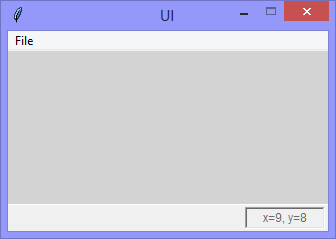

Continuing the exploration of using Tkinter with Python, this version adds
the functionality to populate the options of a 'Combobox' widget by parsing
XML data from a file in the form:



```Python
# ---------- ---------- ---------- ---------- ---------- ---------- ---------- ----------
# Program ui_v1.19_mouse_pointer_tracking
# Written by: Joe Dorward
# Started: 10/10/2024

# This program creates a Tkinter user interface
# * adds the import reference to 'Tk'
# * adds the import reference to 'Menu'
# * adds the menubar_1
# ui_v1.19_mouse_pointer_tracking
# * adds the import reference to 'Label'
# * adds & adapts 'status_bar' from 'ui_v1.04_status_bar.py'
# * binds the user intrface to the <Motion> event - and that to a handler (method)

from tkinter import Tk, Menu, Label

# position the UI window
ui_top = 10
ui_left = 10

# set UI window proportions to 16:9
ui_width = 16 * 20
ui_height = 9 * 20

types_list = []
# ---------- ---------- ---------- ---------- ---------- ---------- ---------- ----------
def add_Menubar():
    # adds menubar_1
    print("[DEBUG] add_Menubar() called")

    menubar_1 = Menu(ui)

    # ---------- ---------- ---------- ---------- ---------- 
    # add file_menu to menubar_1
    file_menu = Menu(menubar_1)
    menubar_1.add_cascade(menu=file_menu, label='File')
    
    # add options to file_menu
    file_menu.add_command(label='Quit', command=ui.quit)    
    # ---------- ---------- ---------- ---------- ---------- 

    # show menubar_1 in UI
    ui['menu'] = menubar_1
# ---------- ---------- ---------- ---------- ---------- ---------- ---------- ----------
def add_Status_Bar():
    # adds the status_bar
    print("[DEBUG] add_Status_Bar() called")

    status_bar_width = ui_width
    status_bar_height = 26
    status_bar_left = 0
    status_bar_top = ui_height - status_bar_height

    # status_bar_border
    status_bar_border = Label(ui, background='#ffffff', name='status_bar_border')
    status_bar_border.place(x=status_bar_left,
                            y=status_bar_top - 1,
                            width=status_bar_width,
                            height=1)

    # status_bar
    status_bar = Label(ui, background='#f0f0f0', name='status_bar')
    status_bar.place(x=status_bar_left,
                     y=status_bar_top,
                     width=status_bar_width,
                     height=status_bar_height)
    
    # coordinates_label
    coordinates_label_width = 80
    coordinates_label_height = status_bar_height - 4
    coordinates_label_left = status_bar_width - coordinates_label_width - 5
    coordinates_label_top = 0

    global coordinates_label
    coordinates_label = Label(status_bar,
                              foreground='dimgray',
                              font=('TkDefaultFont',9),
                              relief='sunken',
                              name='coordinates_label')
    
    coordinates_label.place(x=coordinates_label_left,
                            y=coordinates_label_top,
                            width=coordinates_label_width,
                            height=coordinates_label_height)
# ---------- ---------- ---------- ---------- ---------- ---------- ---------- ----------
def mouse_Motion(event):
    # handles the mouse-pointer <Motion> event over 'ui'

    mouse_x = event.x
    mouse_y = event.y

    coordinates_label.config(text='x=' + str(mouse_x) + ', y=' + str(mouse_y))
# MAIN ///// ////////// ////////// ////////// ////////// ////////// ////////// //////////
if __name__ == '__main__':        
    print("----------------------------------------------------")

    # create the 'blank' UI window
    ui = Tk()
    ui.title("UI")
    ui.config(background='lightgray')
    ui.geometry('%dx%d+%d+%d' % (ui_width, ui_height, ui_left, ui_top))
    ui.wm_resizable(width=False, height=False)
    ui.option_add('*tearOff', False)    
    ui.bind("<Motion>",mouse_Motion)

    # add controls
    add_Menubar()
    add_Status_Bar()

    ui.mainloop()
    print("----------------------------------------------------\n")
```
