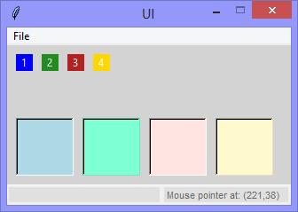
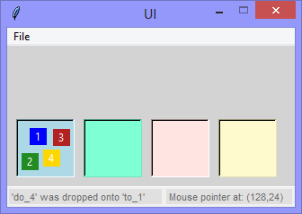
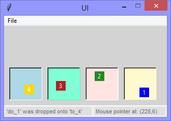

Continuing the exploration of using Tkinter with Python, this version
adds (to the blue 'draggable object') another three 'draggable objects' (green, red, gold),
and four 'target objects' (light-blue, light-green, light-red, light-gold).

Any 'draggable object' can be dragged onto any 'target object' (in any order).

||||
|-|-|-|
||||

```Python
# ---------- ---------- ---------- ---------- ---------- ---------- ---------- ----------
# Program ui_v1.20_drag_and_drop_on_targets.py
# Written by: Joe Dorward
# Started: 21/10/2024

# This program creates a Tkinter user interface
# * adds the import reference to 'Tk'
# * adds the import reference to 'Menu'
# * adds the menubar_1
# ui_v1.20_drag_and_drop_on_targets.py
# * adds 'draggable objects'
# * adds 'target objects'
# * modifies the <ButtonRelease> event handler (method) to 'detect' if a 'draggable object'
#   is being released over a 'target object'

from tkinter import Tk, Menu, Label

# position the UI window
ui_top = 10
ui_left = 10

# set UI window proportions to 16:9
ui_width = 16 * 20
ui_height = 9 * 20
# ---------- ---------- ---------- ---------- ---------- ---------- ---------- ----------
def add_Menubar():
    # adds menubar_1
    print("[DEBUG] add_Menubar() called")

    menubar_1 = Menu(ui)

    # ---------- ---------- ---------- ---------- ---------- 
    # add file_menu to menubar_1
    file_menu = Menu(menubar_1)
    menubar_1.add_cascade(menu=file_menu, label='File')
    
    file_menu.add_command(label='Reset', command=set_reset_ui)

    # add options to file_menu
    file_menu.add_command(label='Quit', command=ui.quit)    
    # ---------- ---------- ---------- ---------- ---------- 

    # show menubar_1 in UI
    ui['menu'] = menubar_1
# ---------- ---------- ---------- ---------- ---------- ---------- ---------- ----------
def add_Status_Bar():
    # adds the status_bar
    print("[DEBUG] add_Status_Bar() called")

    status_bar_width = ui_width
    global status_bar_height
    status_bar_height = 22
    status_bar_left = 0
    status_bar_top = ui_height - status_bar_height

    # status_bar_border
    status_bar_border = Label(ui, background='#ffffff', name='status_bar_border')
    status_bar_border.place(x=status_bar_left,
                            y=status_bar_top - 1,
                            width=status_bar_width,
                            height=1)

    # status_bar
    global status_bar
    status_bar = Label(ui, background='#f0f0f0', name='status_bar')

    status_bar.place(x=status_bar_left,
                     y=status_bar_top,
                     width=status_bar_width,
                     height=status_bar_height)
        
    ui.update()
    #print("  status_bar.winfo_width()",status_bar.winfo_width())
    #print("  status_bar.winfo_height()",status_bar.winfo_height())
# ---------- ---------- ---------- ---------- ---------- ---------- ---------- ----------
def add_Coordinates_Label(parent_widget):
    # adds the coordinates_label    
    print("[DEBUG] add_Coordinates_Label() called")

    # coordinates_label
    label_width = 140
    label_height = parent_widget.winfo_height() - 5
    label_left = parent_widget.winfo_width() - label_width - 5
    label_top = 0

    global coordinates_label
    coordinates_label = Label(parent_widget,
                              background='#e0e0e0',
                              foreground='dimgray',
                              font=('TkDefaultFont',8),
                              relief='flat',
                              anchor='w',
                              name='coordinates_label')

    coordinates_label.config(text='Mouse pointer (' + str(0) + ',' + str(0) + ')')

    coordinates_label.place(x=label_left,
                            y=label_top,
                            width=label_width,
                            height=label_height)
# ---------- ---------- ---------- ---------- ---------- ---------- ---------- ----------
def add_Feedback_Label(parent_widget):
    # adds the feedback_label    
    print("[DEBUG] add_Feedback_Label() called")

    label_width = 170
    label_height = parent_widget.winfo_height() - 5
    label_left = 0
    label_top = 0

    global feedback_label
    feedback_label = Label(parent_widget,
                           background='#e0e0e0',
                           foreground='dimgray',
                           font=('TkDefaultFont',8),
                           relief='flat',
                           anchor='w',
                           name='feedback_label')
    
    feedback_label.place(x=label_left,
                         y=label_top,
                         width=label_width,
                         height=label_height)
# ========== ========== ========== ========== ========== ========== ========== ==========
# ADD DRAG & DROP
# ========== ========== ========== ========== ========== ========== ========== ==========
def add_Draggable_Objects():
    # adds the draggable objects
    print("[DEBUG] Add_Draggable_Objects() called")

    draggable_object_width = 19
    draggable_object_height = 19

    # add draggable_object_1
    global draggable_object_1
    draggable_object_1 = Label(ui, background='blue', foreground='white', text='1', name='do_1')
    draggable_object_1.place(x=10,
                             y=10,
                             width=draggable_object_width,
                             height=draggable_object_height)
    draggable_object_1.bind("<Button-1>", draggable_Object_Grabbed)
    draggable_object_1.bind("<B1-Motion>", draggable_Object_Motion)
    draggable_object_1.bind("<ButtonRelease>", draggable_Object_Release)

    # add draggable_object_2
    global draggable_object_2
    draggable_object_2 = Label(ui, background='forestgreen', foreground='white', text='2', name='do_2')
    draggable_object_2.place(x=20 + draggable_object_width,
                             y=10, width=draggable_object_width,
                             height=draggable_object_height)
    draggable_object_2.bind("<Button-1>", draggable_Object_Grabbed)
    draggable_object_2.bind("<B1-Motion>", draggable_Object_Motion)
    draggable_object_2.bind("<ButtonRelease>", draggable_Object_Release)

    # add draggable_object_3
    global draggable_object_3
    draggable_object_3 = Label(ui, background='firebrick', foreground='white', text='3', name='do_3')
    draggable_object_3.place(x=30 + (2 * draggable_object_width),
                             y=10, width=draggable_object_width,
                             height=draggable_object_height)
    draggable_object_3.bind("<Button-1>", draggable_Object_Grabbed)
    draggable_object_3.bind("<B1-Motion>", draggable_Object_Motion)
    draggable_object_3.bind("<ButtonRelease>", draggable_Object_Release)

    # add draggable_object_4
    global draggable_object_4
    draggable_object_4 = Label(ui, background='gold', foreground='white', text='4', name='do_4')
    draggable_object_4.place(x=40 + (3 * draggable_object_width),
                             y=10, width=draggable_object_width,
                             height=draggable_object_height)
    draggable_object_4.bind("<Button-1>", draggable_Object_Grabbed)
    draggable_object_4.bind("<B1-Motion>", draggable_Object_Motion)
    draggable_object_4.bind("<ButtonRelease>", draggable_Object_Release)
# ---------- ---------- ---------- ---------- ---------- ---------- ---------- ----------
def add_Target_Objects():
    # adds the target objects
    print("[DEBUG] add_Target_Objects() called")

    target_object_width = 65
    target_object_height = 65
    target_object_top = ui.winfo_height() - target_object_height - status_bar_height - 11

    # add target_object_1
    global target_object_1
    target_object_1 = Label(ui, relief='sunken', name='to_1')
    target_object_1.config(background='lightblue')
    target_object_1.place(x=10,
                          y=target_object_top,
                          width=target_object_width,
                          height=target_object_height)

    # add target_object_2
    global target_object_2
    target_object_2 = Label(ui, relief='sunken', name='to_2')
    target_object_2.config(background='aquamarine')
    target_object_2.place(x=20 + target_object_width,
                          y=target_object_top,
                          width=target_object_width,
                          height=target_object_height)
    
    # add target_object_3
    global target_object_3
    target_object_3 = Label(ui, relief='sunken', name='to_3')
    target_object_3.config(background='mistyrose')
    target_object_3.place(x=30 + (2 * target_object_width),
                          y=target_object_top,
                          width=target_object_width,
                          height=target_object_height)

    # add target_object_4
    global target_object_4
    target_object_4 = Label(ui, relief='sunken', name='to_4')
    target_object_4.config(background='lemonchiffon')
    target_object_4.place(x=40 + (3 * target_object_width),
                          y=target_object_top,
                          width=target_object_width,
                          height=target_object_height)
# ---------- ---------- ---------- ---------- ---------- ---------- ---------- ----------
def draggable_Object_Grabbed(event):
    # handles 'grabbing' of draggable object    
    print("[DEBUG] draggable_Object_Grabbed() called")

    object_grabbed_message = "'{}' grabbed".format(event.widget.winfo_name())
    feedback_label.config(text=object_grabbed_message)
# ---------- ---------- ---------- ---------- ---------- ---------- ---------- ----------
def draggable_Object_Motion(event):
    # moves dragged object to follow mouse pointer
    mouse_x = event.x + event.widget.winfo_x()
    mouse_y = event.y + event.widget.winfo_y()

    # get the draggable object
    draggable_object = event.widget
    draggable_object.lift()

    # move it
    draggable_object.place(x=mouse_x, y=mouse_y, anchor="center")
# ---------- ---------- ---------- ---------- ---------- ---------- ---------- ----------
def draggable_Object_Release(event):
    # handles the release of a draggable object
    print("[DEBUG] draggable_Object_Release() called")

    draggable_object_name = event.widget.winfo_name()
    target_object_name = get_Target_Object_Name(event)
    release_message = "'{}' was dropped onto '{}'".format(draggable_object_name,
                                                          target_object_name)

    print(release_message)
    feedback_label.config(text=release_message)
# ---------- ---------- ---------- ---------- ---------- ---------- ---------- ----------
def get_Target_Object_Name(event):
    # gets the name of the target-object
    print("[DEBUG] get_Target_Object_Name() called")

    draggable_object_name = event.widget.winfo_name()
    drop_x = event.widget.winfo_rootx()
    drop_y = event.widget.winfo_rooty()

    event.widget.lower()
    target_object_name = ui.winfo_containing(drop_x, drop_y).winfo_name()
    event.widget.lift()

    if (draggable_object_name != target_object_name):
       return target_object_name
    else:
        return("ui")
# ========== ========== ========== ========== ========== ========== ========== ==========
def mouse_Motion(event):
    # handles the mouse-pointer <Motion> event over 'ui'

    mouse_x = event.x
    mouse_y = event.y

    global coordinates_label
    coordinates_label.config(text='Mouse pointer at: (' + str(mouse_x) + ',' + str(mouse_y) + ')')
# ---------- ---------- ---------- ---------- ---------- ---------- ---------- ----------
def set_reset_ui():
    # sets / resets the ui
    print("[DEBUG] set_reset_ui() called")

    draggable_object_1.destroy()
    draggable_object_2.destroy()
    draggable_object_3.destroy()
    draggable_object_4.destroy()
    add_Draggable_Objects()
    feedback_label.config(text="")
# MAIN ///// ////////// ////////// ////////// ////////// ////////// ////////// //////////
if __name__ == '__main__':        
    print("----------------------------------------------------")

    # create the 'blank' UI window
    ui = Tk()
    ui.title("UI")
    ui.config(background='lightgray')
    ui.geometry('%dx%d+%d+%d' % (ui_width, ui_height, ui_left, ui_top))
    ui.wm_resizable(width=False, height=False)
    ui.option_add('*tearOff', False)    
    ui.bind("<Motion>",mouse_Motion)

    # add controls
    add_Menubar()
    add_Status_Bar()
    add_Feedback_Label(status_bar)
    add_Coordinates_Label(status_bar)
    add_Draggable_Objects()
    add_Target_Objects()

    ui.mainloop()
    print("----------------------------------------------------\n")
```
