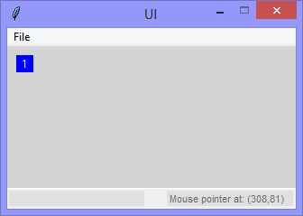
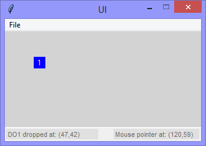

Continuing the exploration of using Tkinter with Python, this version adds
a draggable object (a 'Label' widget), reporting about where it is 'dropped'
and a 'Reset' option to the 'File' menu.

|||
|-|-|
||
|

```Python
# ---------- ---------- ---------- ---------- ---------- ---------- ---------- ----------
# Program ui_v1.20_drag_and_drop_one
# Written by: Joe Dorward
# Started: 10/10/2024

# This program creates a Tkinter user interface
# * adds the import reference to 'Tk'
# * adds the import reference to 'Menu'
# * adds the menubar_1
# ui_v1.20_drag_and_drop_one
# * adds & adapts 'status_bar'
# * adds a draggable object (a 'Label' widget)
# * adds a 'Reset' option to the 'File' menu
# * binds the draggable object to the <B1-Motion> event - and that to a handler (method)
# * binds the draggable object to the <ButtonRelease> event - and that to a handler (method)

from tkinter import Tk, Menu, Label

# position the UI window
ui_top = 10
ui_left = 10

# set UI window proportions to 16:9
ui_width = 16 * 20
ui_height = 9 * 20
# ---------- ---------- ---------- ---------- ---------- ---------- ---------- ----------
def add_Menubar():
    # adds menubar_1
    print("[DEBUG] add_Menubar() called")

    menubar_1 = Menu(ui)

    # ---------- ---------- ---------- ---------- ---------- 
    # add file_menu to menubar_1
    file_menu = Menu(menubar_1)
    menubar_1.add_cascade(menu=file_menu, label='File')
    
    file_menu.add_command(label='Reset', command=set_reset_ui)

    # add options to file_menu
    file_menu.add_command(label='Quit', command=ui.quit)    
    # ---------- ---------- ---------- ---------- ---------- 

    # show menubar_1 in UI
    ui['menu'] = menubar_1
# ---------- ---------- ---------- ---------- ---------- ---------- ---------- ----------
def add_Status_Bar():
    # adds the status_bar
    print("[DEBUG] add_Status_Bar() called")

    status_bar_width = ui_width
    status_bar_height = 22
    status_bar_left = 0
    status_bar_top = ui_height - status_bar_height

    # status_bar_border
    status_bar_border = Label(ui, background='#ffffff', name='status_bar_border')
    status_bar_border.place(x=status_bar_left,
                            y=status_bar_top - 1,
                            width=status_bar_width,
                            height=1)

    # status_bar
    global status_bar
    status_bar = Label(ui, background='#f0f0f0', name='status_bar')

    status_bar.place(x=status_bar_left,
                     y=status_bar_top,
                     width=status_bar_width,
                     height=status_bar_height)
        
    ui.update()
    #print("  status_bar.winfo_width()",status_bar.winfo_width())
    #print("  status_bar.winfo_height()",status_bar.winfo_height())
# ---------- ---------- ---------- ---------- ---------- ---------- ---------- ----------
def add_Coordinates_Label(parent_widget):
    # adds the coordinates_label    
    print("[DEBUG] add_Coordinates_Label() called")

    # coordinates_label
    label_width = 140
    label_height = parent_widget.winfo_height() - 5
    label_left = parent_widget.winfo_width() - label_width - 5
    label_top = 0

    global coordinates_label
    coordinates_label = Label(parent_widget,
                              background='#e0e0e0',
                              foreground='dimgray',
                              font=('TkDefaultFont',8),
                              relief='flat',
                              anchor='w',
                              name='coordinates_label')

    coordinates_label.config(text='Mouse pointer (' + str(0) + ',' + str(0) + ')')

    coordinates_label.place(x=label_left,
                            y=label_top,
                            width=label_width,
                            height=label_height)
# ---------- ---------- ---------- ---------- ---------- ---------- ---------- ----------
def add_Feedback_Label(parent_widget):
    # adds the feedback_label    
    print("[DEBUG] add_Feedback_Label() called")

    label_width = 150
    label_height = parent_widget.winfo_height() - 5
    label_left = 0
    label_top = 0

    global feedback_label
    feedback_label = Label(parent_widget,
                           background='#e0e0e0',
                           foreground='dimgray',
                           font=('TkDefaultFont',8),
                           relief='flat',
                           anchor='w',
                           name='feedback_label')
    
    feedback_label.place(x=label_left,
                         y=label_top,
                         width=label_width,
                         height=label_height)
# ========== ========== ========== ========== ========== ========== ========== ==========
# ADD DRAG & DROP
# ========== ========== ========== ========== ========== ========== ========== ==========
def add_Draggable_Objects():
    # adds the draggable objects
    print("[DEBUG] Add_Draggable_Objects() called")

    global draggable_object_1
    draggable_object_1 = Label(ui, background='blue', foreground='white', text='1', name='1')
    draggable_object_1.place(x=10, y=10, width=19, height=19)
    draggable_object_1.bind("<B1-Motion>", draggable_Object_Motion)
    draggable_object_1.bind("<ButtonRelease>", draggable_Object_Release)
# ---------- ---------- ---------- ---------- ---------- ---------- ---------- ----------
def draggable_Object_Motion(event):
    # moves dragged object to follow mouse pointer
    mouse_x = event.x + event.widget.winfo_x()
    mouse_y = event.y + event.widget.winfo_y()

    # get the draggable object
    draggable_object = event.widget
    draggable_object.lift()
    draggable_object.place(x=mouse_x, y=mouse_y, anchor="center")
# ---------- ---------- ---------- ---------- ---------- ---------- ---------- ----------
def draggable_Object_Release(event):
    # handles the 'drop' of draggable objects

    # get the draggable object
    draggable_object_name = event.widget.winfo_name()
    drop_x = event.widget.winfo_x()
    drop_y = event.widget.winfo_y()

    feedback_label.config(text="DO{} dropped at: ({},{})".format(draggable_object_name,drop_x,drop_y))
# ========== ========== ========== ========== ========== ========== ========== ==========
def mouse_Motion(event):
    # handles the mouse-pointer <Motion> event over 'ui'

    mouse_x = event.x
    mouse_y = event.y

    global coordinates_label
    coordinates_label.config(text='Mouse pointer at: (' + str(mouse_x) + ',' + str(mouse_y) + ')')
# ---------- ---------- ---------- ---------- ---------- ---------- ---------- ----------
def set_reset_ui():
    # sets / resets the ui
    print("[DEBUG] set_reset_ui() called")

    draggable_object_1.destroy()
    add_Draggable_Objects()
    feedback_label.config(text="")
# MAIN ///// ////////// ////////// ////////// ////////// ////////// ////////// //////////
if __name__ == '__main__':        
    print("----------------------------------------------------")

    # create the 'blank' UI window
    ui = Tk()
    ui.title("UI")
    ui.config(background='lightgray')
    ui.geometry('%dx%d+%d+%d' % (ui_width, ui_height, ui_left, ui_top))
    ui.wm_resizable(width=False, height=False)
    ui.option_add('*tearOff', False)    
    ui.bind("<Motion>",mouse_Motion)

    # add controls
    add_Menubar()
    add_Status_Bar()
    add_Feedback_Label(status_bar)
    add_Coordinates_Label(status_bar)
    add_Draggable_Objects()

    ui.mainloop()
    print("----------------------------------------------------\n")
```
