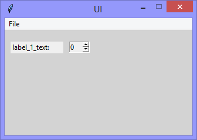
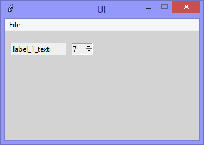

Continuing the exploration of using Tkinter with Python, this version adds
a 'Spinbox' widget.

|||
|-|-|
|||

```Python
# ---------- ---------- ---------- ---------- ---------- ---------- ---------- ----------
# Program ui_v1.21_spinbox.py
# Written by: Joe Dorward
# Started: 14/10/2024

# This program creates a Tkinter user interface
# * adds the import reference to 'Tk'
# * adds the import reference to 'Menu'
# * adds the menubar_1
# v1.21_spinbox
# * adds the import reference to 'Spinbox'

from tkinter import Tk, Menu, Label, Spinbox

# position the UI window
ui_top = 10
ui_left = 10

# set UI window proportions to 16:9
ui_width = 16 * 20
ui_height = 9 * 20
# ---------- ---------- ---------- ---------- ---------- ---------- ---------- ----------
def add_Menubar():
    # adds menubar_1
    print("[DEBUG] Add_Menubar() called")

    menubar_1 = Menu(ui)

    # add 'File' menu
    file_menu = Menu(menubar_1)
    menubar_1.add_cascade(menu=file_menu, label='File')

    # add options to 'File' menu
    file_menu.add_command(label='Quit', command=ui.quit)

    # show menubar_1 in UI
    ui['menu'] = menubar_1
# ---------- ---------- ---------- ---------- ---------- ---------- ---------- ----------
def add_Label_1():
    # adds the label_1
    print("[DEBUG] add_Label_1() called")

    label_1_left = 10
    label_1_top = 20
    label_1_width = 90
    label_1_height = 20

    # label one
    label_1 = Label(ui, anchor='w', text="label_1_text:", name='label_1')
    label_1.place(x=label_1_left,
                  y=label_1_top,
                  width=label_1_width,
                  height=label_1_height)
# ---------- ---------- ---------- ---------- ---------- ---------- ---------- ----------
def add_Spinbox_1():
    # adds the spinbox_1
    print("[DEBUG] add_Spinbox_1() called")

    spinbox_1_left = 110
    spinbox_1_top = 20
    spinbox_1_width = 35

    # spinbox_1
    spinbox_1 = Spinbox(ui, from_=0, to=9, state='readonly', name='spinbox_1')
    spinbox_1.place(x=spinbox_1_left,
                    y=spinbox_1_top,
                    width=spinbox_1_width)
# MAIN ///// ////////// ////////// ////////// ////////// ////////// ////////// //////////
if __name__ == '__main__':        
    print("----------------------------------------------------")

    # create the 'blank' UI window
    ui = Tk()
    ui.title("UI")
    ui.config(background='lightgray')
    ui.geometry('%dx%d+%d+%d' % (ui_width, ui_height, ui_left, ui_top))
    ui.wm_resizable(width=False, height=False)
    ui.option_add('*tearOff', False)

    # add controls
    add_Menubar()
    add_Label_1()
    add_Spinbox_1()

    ui.mainloop()
    print("----------------------------------------------------\n")
```
