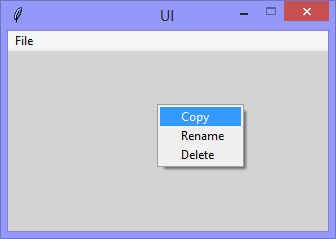
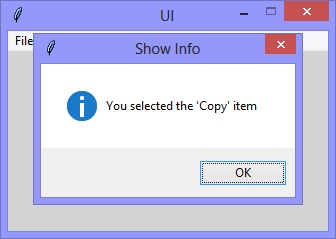

Continuing the exploration of using Tkinter with Python, this version adds
a 'Menu' widget as a context-menu, and reports which menu item was selected
in a 'showinfo'.

|||
|-|-|
|||

```Python
# ---------- ---------- ---------- ---------- ---------- ---------- ---------- ----------
# Program ui_v1.22_context_menu.py
# Written by: Joe Dorward
# Started: 14/10/2024

# This program creates a Tkinter user interface
# * adds the import reference to 'Tk'
# * adds the import reference to 'Menu'
# * adds the menubar_1
# v1.22_context_menu
# * adds the import reference to 'messagebox'
# * adds context_menu
# * binds ui to the <Button-3> (keypress) event
# * adds a handler (method) to handle 'showinfo' response

from tkinter import Tk, Menu, messagebox as showinfo_1

# position the UI window
ui_top = 10
ui_left = 10

# set UI window proportions to 16:9
ui_width = 16 * 20
ui_height = 9 * 20
# ---------- ---------- ---------- ---------- ---------- ---------- ---------- ----------
def add_Menubar():
    # adds menubar_1
    print("[DEBUG] Add_Menubar() called")

    menubar_1 = Menu(ui)

    # add 'File' menu
    file_menu = Menu(menubar_1)
    menubar_1.add_cascade(menu=file_menu, label='File')

    # add options to 'File' menu
    file_menu.add_command(label='Quit', command=ui.quit)

    # show menubar_1 in UI
    ui['menu'] = menubar_1
# ---------- ---------- ---------- ---------- ---------- ---------- ---------- ----------
def add_Context_Menu():
    # adds the context_menu
    print("[DEBUG] add_Context_Menu() called")

    global context_menu
    context_menu = Menu(ui, tearoff='false')
    context_menu.add_command(label='Copy', command=lambda:Button_3_Handler('Copy'))
    context_menu.add_command(label='Rename', command=lambda:Button_3_Handler('Rename'))
    context_menu.add_command(label='Delete', command=lambda:Button_3_Handler('Delete'))
    
    ui.bind("<Button-3>", show_Context_Menu)
# ---------- ---------- ---------- ---------- ---------- ---------- ---------- ----------
def show_Context_Menu(event):
    # shows the context_menu
    print("[DEBUG] show_Context_Menu() called")

    context_menu.tk_popup(event.x_root, event.y_root)
# ---------- ---------- ---------- ---------- ---------- ---------- ---------- ----------
def Button_3_Handler(menu_item):
    # raises the showinfo_1 messagebox
    print("[DEBUG] Button_3_Handler() called")

    showinfo_1.showinfo(title="Show Info", 
                        message="You selected the '{}' item".format(menu_item))
# MAIN ///// ////////// ////////// ////////// ////////// ////////// ////////// //////////
if __name__ == '__main__':        
    print("----------------------------------------------------")

    # create the 'blank' UI window
    ui = Tk()
    ui.title("UI")
    ui.config(background='lightgray')
    ui.geometry('%dx%d+%d+%d' % (ui_width, ui_height, ui_left, ui_top))
    ui.wm_resizable(width=False, height=False)
    ui.option_add('*tearOff', False)

    # add controls
    add_Menubar()
    add_Context_Menu()

    ui.mainloop()
    print("----------------------------------------------------\n")
```
