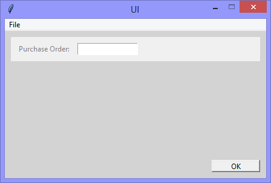
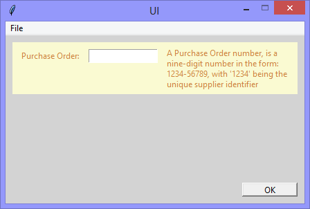
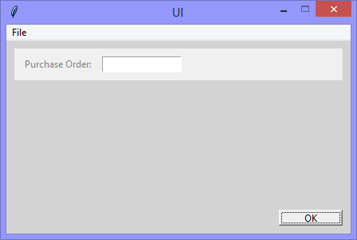

Continuing the exploration of using Tkinter with Python, this version adds
the functionality to 'read in' the text of the user interface from a DITA
XML file - reducing the need for developers to 'get involved' with the
actual words of the user interface.

The promise of DITA XML includes the creation of *reusable content* (that is)
content that is created as stand-alone components (the *single source*) that
are available to be reused by anyone for any purpose, and that (as in this 
example) includes the text in the user interface being 'read in' from a DITA
XML file during a build.

```dita
<?xml version="1.0" encoding="UTF-8"?>
<!DOCTYPE topic PUBLIC "-//OASIS//DTD DITA Topic//EN" "topic.dtd">
<topic id="terms_and_definitions">
	<title>Terms, and Definitions</title>
	<body>
		<label id="purchase_order_number_term" outputclass="term">
			Purchase Order:
		</label>
		<label id="purchase_order_number_definition" outputclass="definition">
			A Purchase Order number, is a
			nine-digit number in the form:
			1234-56789, with '1234' being
			the unique supplier identifier
		</label>
	</body>
</topic>
```

||||
|-|-|-|
||||
|The application runs showing the *Purchase Order* 'Entry' widget|The *Purchase Order* 'Entry' widget gets focus|The *OK* 'Button' widget gets focus|

```Python
# ---------- ---------- ---------- ---------- ---------- ---------- ---------- ----------
# Program ui_v1.23_single_sourcing_reusing_dita_xml.py
# Written by: Joe Dorward
# Started: 23/09/2024

# This program creates a Tkinter user interface
# * adds the import reference to 'Tk'
# * adds the import reference to 'Menu'
# * adds the menubar_1
# v1.23_single_sourcing_reusing_dita_xml
# * adds the import reference to 'Frame'
# * adds the import reference to 'Label'
# * adds the import reference to 'Entry'
# * adds the import reference to 'Button'
# * adds the import reference to 'os'
# * adds the import reference to 'xml.dom.minidom'
# * binds purchase_order_entry to the <FocusIn> event - and that event to a handler (method)

from tkinter import Tk, Menu, Frame, Label, Entry, Button
import os
import xml.dom.minidom

# position the UI window
ui_top = 10
ui_left = 10

# set UI window proportions to 16:9
ui_width = 16 * 27
ui_height = 9 * 27

button_width = 80
button_height = 20
# ---------- ---------- ---------- ---------- ---------- ---------- ---------- ----------
def add_Menubar():
    # adds menubar_1
    print("[DEBUG] Add_Menubar() called")

    menubar_1 = Menu(ui)

    # add 'File' menu
    file_menu = Menu(menubar_1)
    menubar_1.add_cascade(menu=file_menu, label='File')

    # add options to 'File' menu
    file_menu.add_command(label='Quit', command=ui.quit)

    # show menubar_1 in UI
    ui['menu'] = menubar_1
# ---------- ---------- ---------- ---------- ---------- ---------- ---------- ----------
def add_Purchase_Order_Frame():
    # adds the purchase_order_frame
    print("[DEBUG] add_Purchase_Order_Frame() called")

    frame_width = ui_width - 20
    frame_height = 40

    global purchase_order_frame
    purchase_order_frame = Frame(ui, name="frame_1")    

    purchase_order_frame.place(x=10, y=10, width=frame_width, height=frame_height)
# ---------- ---------- ---------- ---------- ---------- ---------- ---------- ----------
def add_Purchase_Order_Number_Term_Label(parent_widget):
    # adds the purchase_order_number_term_label
    print("[DEBUG] add_Purchase_Order_Number_Term_Label() called")

    label_left = 10
    label_top = 9
    label_width = 95
    label_height = 20

    # add purchase_order_number_term_label
    global purchase_order_number_term_label
    purchase_order_number_term_label = Label(parent_widget,
                                              foreground='gray',
                                             justify='left',
                                             anchor='nw',
                                             name='purchase_order_number_term_label')
    
    purchase_order_number_term_label.place(x=label_left,
                                           y=label_top,
                                           width=label_width,
                                           height=label_height)
# ---------- ---------- ---------- ---------- ---------- ---------- ---------- ----------
def add_Purchase_Order_Entry(parent_widget):
    # adds the purchase_order_entry
    print("[DEBUG] add_Purchase_Order_Entry() called")

    entry_left = 110
    entry_top = 10
    entry_width = 100
    entry_height = 20

    # add purchase_order_entry
    purchase_order_entry = Entry(parent_widget, name='purchase_order_entry')
    
    purchase_order_entry.place(x=entry_left,
                               y=entry_top,
                               width=entry_width,
                               height=entry_height)

    purchase_order_entry.bind("<FocusIn>", purchase_order_entry_FocusIn)
    purchase_order_entry.bind("<FocusOut>", purchase_order_entry_FocusOut)
# ---------- ---------- ---------- ---------- ---------- ---------- ---------- ----------
def add_Purchase_Order_Number_Definition_Label(parent_widget):
    # adds the purchase_order_number_definition_label
    print("[DEBUG] add_Purchase_Order_Number_Definition_Label() called")
    
    # add purchase_order_number_definition_label
    global purchase_order_number_definition_label
    purchase_order_number_definition_label = Label(parent_widget,
                                                   background='SystemButtonFace',
                                                   foreground='SystemButtonFace',
                                                   wraplength=185,
                                                   justify='left',
                                                   anchor='nw',
                                                   name='purchase_order_number_definition_label')
    
    purchase_order_number_definition_label.place(x=220,
                                                 y=5,
                                                 width=190)
# ---------- ---------- ---------- ---------- ---------- ---------- ---------- ----------
def parse_XML():
    # parses XML 
    print("[DEBUG] parse_XML() called")

    # get path to file
    path_to_file = os.getcwd() + "\\dita_xml\\terms_and_definitions.dita"

    # parse file
    labels_text = xml.dom.minidom.parse(path_to_file)

    # add 'text' to 'Label' widgets
    for each_label in labels_text.getElementsByTagName("label"):

        if (each_label.attributes.getNamedItem("id").value == "purchase_order_number_term"):
            label_text = each_label.firstChild.nodeValue
            label_text = label_text.strip()
            print(" ",label_text)
            purchase_order_number_term_label.config(text=label_text)

        if (each_label.attributes.getNamedItem("id").value == "purchase_order_number_definition"):
            label_text = each_label.firstChild.nodeValue
            label_text = label_text.strip()
            label_text = label_text.split()
            label_text = " ".join(label_text)
            print(" ",label_text)
            purchase_order_number_definition_label.config(text=label_text)
# ---------- ---------- ---------- ---------- ---------- ---------- ---------- ----------
def purchase_order_entry_FocusIn(event):
    # handles purchase_order_entry getting focus
    print("[DEBUG] purchase_order_entry_FocusIn() called")

    # update 'Frame' widget
    purchase_order_frame.config(background='LightGoldenrodYellow')    
    purchase_order_frame.place(height=75)

    # update 'term' label
    purchase_order_number_term_label.config(background='LightGoldenrodYellow',
                                            foreground='Peru')
    
    # update 'definition' label
    purchase_order_number_definition_label.config(background='LightGoldenrodYellow',
                                                  foreground='Peru')
# ---------- ---------- ---------- ---------- ---------- ---------- ---------- ----------
def purchase_order_entry_FocusOut(event):
    # handles purchase_order_entry losing focus
    print("[DEBUG] purchase_order_entry_FocusOut() called")

    purchase_order_number_definition_label.config(background='SystemButtonFace',
						  foreground='SystemButtonFace')

    purchase_order_number_term_label.config(background='SystemButtonFace',
					    foreground='gray')

    purchase_order_frame.config(background='SystemButtonFace')    
    purchase_order_frame.place(height=40)
# ---------- ---------- ---------- ---------- ---------- ---------- ---------- ----------
def add_OK_Button():
    # adds the ok_button
    print("[DEBUG] add_OK_Button() called")

    button_left = ui_width - button_width - 10
    button_top = ui_height - button_height - 10

    ok_button = Button(ui, text='OK', name='ok_button', command=ui.quit)    
    ok_button.place(x=button_left, y=button_top, width=button_width, height=button_height)
# MAIN ///// ////////// ////////// ////////// ////////// ////////// ////////// //////////
if __name__ == '__main__':        
    print("----------------------------------------------------")

    # create the 'blank' UI window
    ui = Tk()
    ui.title("UI")
    ui.config(background='lightgray')
    ui.geometry('%dx%d+%d+%d' % (ui_width, ui_height, ui_left, ui_top))
    ui.wm_resizable(width=False, height=False)
    ui.option_add('*tearOff', False)

    # add controls
    add_Menubar()
    add_Purchase_Order_Frame()
    add_Purchase_Order_Number_Term_Label(purchase_order_frame)
    add_Purchase_Order_Entry(purchase_order_frame)
    add_Purchase_Order_Number_Definition_Label(purchase_order_frame)
    add_OK_Button()
    parse_XML()
    get_Widget_Config_Values(ui)

    ui.mainloop()
    print("----------------------------------------------------\n")
```
