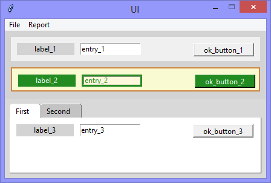
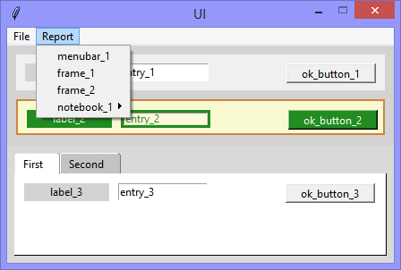
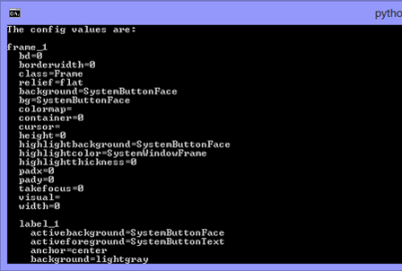

One of the cool features of the Tkinter package, is that every 'thing' we
see is either (a) the main user interface, (b) a child-widget of it, or (c)
a child-widget of a child-widget - and the cool fact about that is that
the configuration values of the main user interface, and all widgets /
child-widgets can be interrogated by iteration.

Continuing the exploration of using Tkinter with Python, this version adds
the interrogation by iteration of widget configuration values.

||||
|-|-|-|
||||
|The application runs showing various widgets|The open *Report* 'Menu' widget|The *Command Prompt* after the *frame_1* option is selected|

```Python
# ---------- ---------- ---------- ---------- ---------- ---------- ---------- ----------
# Program ui_v1.24_get_widget_config_values.py
# Written by: Joe Dorward
# Started: 25/10/2024

# This program creates a Tkinter user interface
# * adds the import reference to 'Tk'
# * adds the import reference to 'Menu'
# * adds the menubar_1
# v1.24_get_widget_config_values
# * adds the import reference to 'Frame'
# * adds the import reference to 'Label'
# * adds the import reference to 'Entry'
# * adds the import reference to 'StringVar'
# * adds the import reference to 'Button'
# * adds the import reference to 'ttk' for the 'Notebook' widget

from tkinter import Tk, Menu, Frame, Label, Entry, StringVar, Button, ttk

# position the UI window
ui_top = 10
ui_left = 10

# set UI window proportions to 16:9
ui_width = 16 * 27
ui_height = 9 * 27
# ---------- ---------- ---------- ---------- ---------- ---------- ---------- ----------
def add_Menubar():
    # adds menubar_1
    print("[DEBUG] Add_Menubar() called")
               
    global menubar_1
    menubar_1 = Menu(ui, title='Menubar 1', name='menubar_1')
    # ---------- ---------- ---------- ---------- ----------
    # add 'File' menu
    file_menu = Menu(menubar_1, title='File menu', name='file_menu')
    menubar_1.add_cascade(menu=file_menu, label='File')

    # add options
    file_menu.add_command(label='Quit', command=ui.quit)
    # ---------- ---------- ---------- ---------- ----------
    # add 'Report' menu
    report_menu = Menu(menubar_1, title='Report menu', name='report_menu')
    menubar_1.add_cascade(menu=report_menu, label='Report')

    # add options
    report_menu.add_command(label='menubar_1', command=report_menubar_1_Config_Values)
    report_menu.add_command(label='frame_1', command=report_frame_1_Config_Values)
    report_menu.add_command(label='frame_2', command=report_frame_2_Config_Values)
    # ---------- ---------- ---------- ---------- ----------
    # add 'notebook_1_menu' to 'report_menu'
    notebook_1_menu = Menu(report_menu, title='notebook_1', name='notebook_1_menu')
    report_menu.add_cascade(menu=notebook_1_menu, label='notebook_1')

    # add options
    notebook_1_menu.add_command(label='notebook_1', command=report_notebook_1_Config_Values)
    notebook_1_menu.add_command(label='page_1', command=report_page_1_Config_Values)
    notebook_1_menu.add_command(label='page_2', command=report_page_2_Config_Values)
    # ---------- ---------- ---------- ---------- ----------

    # show menubar_1 in 'ui'
    ui['menu'] = menubar_1
# ---------- ---------- ---------- ---------- ---------- ---------- ---------- ----------
def add_Frames():
    # adds 'Frame' widgets
    print("[DEBUG] add_Frames() called")

    global frame_width
    frame_width = ui_width - 20
    frame_height = 40
    frame_top = 10

    global frame_1
    frame_1 = Frame(ui, name="frame_1")
    frame_1.place(x=10, y=10, width=frame_width, height=frame_height)

    frame_top = frame_top + frame_height + 10

    global frame_2
    frame_2 = Frame(ui,
                    background='LightGoldenrodYellow',
                    highlightthickness=2,
                    highlightbackground='Peru',                    
                    name="frame_2")
    frame_2.place(x=10, y=frame_top, width=frame_width, height=frame_height)
# ---------- ---------- ---------- ---------- ---------- ---------- ---------- ----------
def add_Notebook():
    # adds notebook_1
    print("[DEBUG] add_Notebook() called")

    notebook_1_width = ui_width
    notebook_1_height = 131
    notebook_1_left = 0
    notebook_1_top = 112

    # Create an instance of ttk style
    notebook_1_style = ttk.Style()
    notebook_1_style.theme_use('classic')

    padding_left = 9
    padding_top = 4
    padding_right = 18
    padding_bottom = 3

    notebook_1_style.configure('TNotebook.Tab',
                               padding=[padding_left,
                                        padding_top,
                                        padding_right,
                                        padding_bottom])
          
    notebook_1_style.map("TNotebook.Tab",
                         background=[("selected", 'White')], # must match 'page' background
                         foreground=[("selected", 'Black')])
                                   
    # add notebook_1
    global notebook_1
    notebook_1 = ttk.Notebook(ui, name='notebook_1')
    notebook_1.config(padding=8)
    notebook_1.place(x=notebook_1_left,
                     y=notebook_1_top,
                     width=notebook_1_width,
                     height=notebook_1_height)

    # add page_1
    global page_1
    page_1 = Frame(notebook_1, background='White', name='page_1')
    notebook_1.add(page_1, text='First', padding=0)

    # add page_2
    global page_2
    page_2 = Frame(notebook_1, background='White', name='page_2')
    notebook_1.add(page_2, text='Second')
# ---------- ---------- ---------- ---------- ---------- ---------- ---------- ----------
def add_Labels():
    # adds 'Label' widgets
    print("[DEBUG] add_Labels() called")

    label_left = 10
    label_top = 10
    label_width = 95
    label_height = 20

    # add label_1
    label_1 = Label(frame_1, background='lightgray', text='label_1', name='label_1')
    label_1.place(x=label_left, y=label_top, width=label_width, height=label_height)
    # ---------- ---------- ---------- ---------- 
    label_left = 10
    label_top = 10
    label_width = 95
    label_height = 20

    # add label_2
    label_2 = Label(frame_2, text='label_2', background='Forestgreen', foreground='Honeydew', name='label_2')
    label_2.place(x=label_left, y=label_top, width=label_width, height=label_height)
    # ---------- ---------- ---------- ---------- 
    label_left = 10
    label_top = 10
    label_width = 95
    label_height = 20

    # add label_3
    label_3 = Label(page_1, background='lightgray', text='label_3', name='label_3')
    label_3.place(x=label_left, y=label_top, width=label_width, height=label_height)

    # add label_4
    label_4 = Label(page_2, background='lightgray', text='label_4', name='label_4')
    label_4.place(x=label_left, y=label_top, width=label_width, height=label_height)
# ---------- ---------- ---------- ---------- ---------- ---------- ---------- ----------
def add_Entrys():
    # adds 'Entry' widgets
    print("[DEBUG] add_Entrys() called")

    entry_left = 115
    entry_top = 10
    entry_width = 100
    entry_height = 20

    # add entry_1
    entry_1_stringvar = StringVar(ui, value='entry_1')
    entry_1 = Entry(frame_1, textvariable=entry_1_stringvar, name='entry_1')
    entry_1.place(x=entry_left, y=entry_top, width=entry_width, height=entry_height)
    # ---------- ---------- ---------- ---------- 
    # add entry_2
    entry_2_stringvar = StringVar(ui, value='entry_2')
    entry_2 = Entry(frame_2,
                    background='Cornsilk',
                    foreground='Forestgreen',
                    highlightthickness=3,
                    highlightbackground='Forestgreen',
                    highlightcolor='Firebrick',
                    textvariable=entry_2_stringvar,
                    name='entry_2')
    entry_2.place(x=entry_left, y=entry_top, width=entry_width, height=entry_height)
    # ---------- ---------- ---------- ----------
    # add entry_3
    entry_3_stringvar = StringVar(ui, value='entry_3')
    entry_3 = Entry(page_1, textvariable=entry_3_stringvar, name='entry_3')
    entry_3.place(x=entry_left, y=entry_top, width=entry_width, height=entry_height)
    # ---------- ---------- ---------- ----------
    # add entry_4
    entry_4_stringvar = StringVar(ui, value='entry_4')
    entry_4 = Entry(page_2, textvariable=entry_4_stringvar, name='entry_4')
    entry_4.place(x=entry_left, y=entry_top, width=entry_width, height=entry_height)
# ---------- ---------- ---------- ---------- ---------- ---------- ---------- ----------
def add_OK_Buttons():
    # adds the ok_button
    print("[DEBUG] add_OK_Buttons() called")

    button_width = 100
    button_height = 22

    button_left = frame_width - button_width - 10
    button_top = 10

    # ok_button_1
    ok_button_1 = Button(frame_1, text='ok_button_1', name='ok_button_1')    
    ok_button_1.place(x=button_left, y=button_top, width=button_width, height=button_height)
    # ---------- ---------- ---------- ----------
    # ok_button_2
    ok_button_1 = Button(frame_2, text='ok_button_2',
                         activebackground='Honeydew', 
                         activeforeground='Forestgreen',
                         background='Forestgreen',
                         foreground='Honeydew',               
                         name='ok_button_2')    
    ok_button_1.place(x=button_left, y=button_top, width=button_width, height=button_height)
    # ---------- ---------- ---------- ----------
    # ok_button_3
    ok_button_3 = Button(page_1, text='ok_button_3', name='ok_button_3')    
    ok_button_3.place(x=button_left, y=button_top, width=button_width, height=button_height)
    # ---------- ---------- ---------- ----------
    # ok_button_4
    ok_button_4 = Button(page_2, text='ok_button_4', name='ok_button_4')    
    ok_button_4.place(x=button_left, y=button_top, width=button_width, height=button_height)
# ---------- ---------- ---------- ---------- ---------- ---------- ---------- ----------
def report_menubar_1_Config_Values():
    # reports menubar_1 .config values
    print("[DEBUG] report_menubar_1_Config_Values() called")

    report_Widget_Config_Values(menubar_1)
# ---------- ---------- ---------- ---------- ---------- ---------- ---------- ----------
def report_frame_1_Config_Values():
    # reports frame_1 .config values
    print("[DEBUG] report_frame_1_Config_Values() called")

    report_Widget_Config_Values(frame_1)
# ---------- ---------- ---------- ---------- ---------- ---------- ---------- ----------
def report_frame_2_Config_Values():
    # reports frame_2 .config values
    print("[DEBUG] report_frame_2_Config_Values() called")

    report_Widget_Config_Values(frame_2)
# ---------- ---------- ---------- ---------- ---------- ---------- ---------- ----------
def report_notebook_1_Config_Values():
    # reports notebook_1 .config values
    print("[DEBUG] report_notebook_1_Config_Values() called")

    #report_Widget_Config_Values(notebook_1)
    print("----------------------------------------------------")
    print("The config values are:")
    print("\n{}".format(notebook_1.winfo_name()))

    for each_property in notebook_1.config():
        print(" ",each_property + "=" + str(notebook_1.cget(each_property)))
# ---------- ---------- ---------- ---------- ---------- ---------- ---------- ----------
def report_page_1_Config_Values():
    # reports page_1 .config values
    print("[DEBUG] report_page_1_Config_Values() called")

    report_Widget_Config_Values(page_1)
# ---------- ---------- ---------- ---------- ---------- ---------- ---------- ----------
def report_page_2_Config_Values():
    # reports page_2 .config values
    print("[DEBUG] report_page_2_Config_Values() called")

    report_Widget_Config_Values(page_2)
# ---------- ---------- ---------- ---------- ---------- ---------- ---------- ----------
def report_Widget_Config_Values(widget):
    # reports widget .config values
    print("[DEBUG] report_Widget_Config_Values() called")

    print("----------------------------------------------------")
    print("The config values are:")
    print("\n{}".format(widget.winfo_name()))

    for each_property in widget.config():
        print(" ",each_property + "=" + str(widget.cget(each_property)))


    for each_child in widget.winfo_children():
        print("\n ",each_child.winfo_name())

        for each_property in each_child.config():
            print("   ",each_property + "=" + str(each_child.cget(each_property)))
# ---------- ---------- ---------- ---------- ---------- ---------- ---------- ----------
def get_Widget_Config_Values():
    # gets .config values
    print("[DEBUG] get_Widget_Config() called")

    print("\nThe child widgets of 'ui':")
    for each_child in ui.winfo_children():
        print(" ",each_child.winfo_name())

        for each_property in each_child.config():
            print("   ",each_property + "=" + str(each_child.cget(each_property)))

        for each_grandchild in each_child.winfo_children():
            print("     ",each_grandchild.winfo_name())

            for each_property in each_grandchild.config():
                print("       ",each_property + "=" + str(each_grandchild.cget(each_property)))


# MAIN ///// ////////// ////////// ////////// ////////// ////////// ////////// //////////
if __name__ == '__main__':        
    print("----------------------------------------------------")

    # create the 'blank' UI window
    ui = Tk()
    ui.title("UI")
    ui.config(background='lightgray')
    ui.geometry('%dx%d+%d+%d' % (ui_width, ui_height, ui_left, ui_top))
    ui.wm_resizable(width=False, height=False)
    ui.option_add('*tearOff', False)

    # add controls
    add_Menubar()
    add_Frames()
    add_Notebook()

    add_Labels()
    add_Entrys()
    add_OK_Buttons()

    ui.mainloop()
    print("----------------------------------------------------\n")
```
