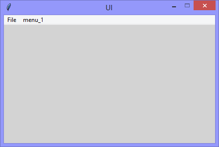
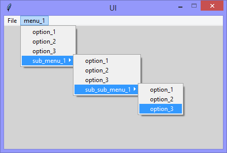

Continuing the exploration of using Tkinter with Python, this version adds
a menu, with a sub-menu, and a sub-sub-menu.

|||
|-|-|
|||

```Python
# ---------- ---------- ---------- ---------- ---------- ---------- ---------- ----------
# Program ui_v1.25_menu_submenu.py
# Written by: Joe Dorward
# Started: 30/10/2024

# This program creates a Tkinter user interface
# * adds the import reference to 'Tk'
# * adds the import reference to 'Menu'
# * adds the menubar_1
# ui_v1.25_menu_submenu
# * adds 'menu_1' to 'menubar_1'
# * adds options to 'menu_1'
# * adds 'sub_menu_1' to 'menu_1'
# * adds options to 'sub_menu_1'
# * adds 'sub_sub_menu_1' to 'sub_menu_1'
# * adds options to 'sub_sub_menu_1'

from tkinter import Tk, Menu

# position the UI window
ui_top = 10
ui_left = 10

# set UI window proportions to 16:9
ui_width = 16 * 27
ui_height = 9 * 27
# ---------- ---------- ---------- ---------- ---------- ---------- ---------- ----------
def add_Menubar():
    # adds menubar_1
    print("[DEBUG] add_Menubar() called")
               
    global menubar_1
    menubar_1 = Menu(ui, title='Menubar 1', name='menubar_1')
    # ---------- ---------- ---------- ---------- ----------
    # add file_menu to menubar_1
    file_menu = Menu(menubar_1, title='File menu', name='file_menu')
    menubar_1.add_cascade(menu=file_menu, label='File')

    # add options
    file_menu.add_command(label='Quit', command=ui.quit)
    # ---------- ---------- ---------- ---------- ----------

    # show menubar_1 in 'ui'
    ui['menu'] = menubar_1
# ---------- ---------- ---------- ---------- ---------- ---------- ---------- ----------
def add_Menu():
    # adds menu_1 to menubar_1
    print("[DEBUG] add_Menu() called")

    # add 'menu_1'
    global menu_1
    menu_1 = Menu(menubar_1, title='menu_1', name='menu_1')
    menubar_1.add_cascade(menu=menu_1, label='menu_1')

    # add options
    menu_1.add_command(label='option_1')
    menu_1.add_command(label='option_2')
    menu_1.add_command(label='option_3')
# ---------- ---------- ---------- ---------- ---------- ---------- ---------- ----------
def add_Sub_Menu():
    # adds sub_menu_1 to menu_1
    print("[DEBUG] add_Sub_Menu() called")

    # add 'sub_menu_1'
    global sub_menu_1
    sub_menu_1 = Menu(menu_1, title='sub_menu_1', name='sub_menu_1')
    menu_1.add_cascade(menu=sub_menu_1, label='sub_menu_1')

    # add options
    sub_menu_1.add_command(label='option_1')
    sub_menu_1.add_command(label='option_2')
    sub_menu_1.add_command(label='option_3')
# ---------- ---------- ---------- ---------- ---------- ---------- ---------- ----------
def add_Sub_Sub_Menu():
    # adds sub_sub_menu_1 to sub_menu_1
    print("[DEBUG] add_Sub_Sub_Menu() called")

    # add 'sub_sub_menu_1'
    sub_sub_menu_1 = Menu(sub_menu_1, title='sub_sub_menu_1', name='sub_sub_menu_1')
    sub_menu_1.add_cascade(menu=sub_sub_menu_1, label='sub_sub_menu_1')

    # add options
    sub_sub_menu_1.add_command(label='option_1')
    sub_sub_menu_1.add_command(label='option_2')
    sub_sub_menu_1.add_command(label='option_3')
# MAIN ///// ////////// ////////// ////////// ////////// ////////// ////////// //////////
if __name__ == '__main__':        
    print("----------------------------------------------------")

    # create the 'blank' UI window
    ui = Tk()
    ui.title("UI")
    ui.config(background='lightgray')
    ui.geometry('%dx%d+%d+%d' % (ui_width, ui_height, ui_left, ui_top))
    ui.wm_resizable(width=False, height=False)
    ui.option_add('*tearOff', False)

    # add controls
    add_Menubar()
    add_Menu()
    add_Sub_Menu()
    add_Sub_Sub_Menu()

    ui.mainloop()
    print("----------------------------------------------------\n")
```
