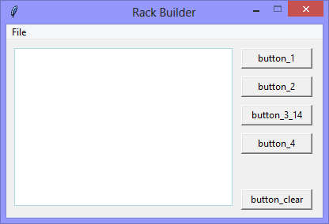

Continuing the exploration of using Tkinter with Python, this version adds
a 'Text' widget, and interacts with it programmatically by 'Button' clicks.

The second illustration shows the user interface after `button_1`, `button_2`,
`button_1`, `button_2`, and `button_3_14` have been clicked.

The `button_3_14` inserts the text `[INSERTED]` at line=3, and character=14.

**Know this**: 'Line 3' is not the third-line that you see in the 'Text' widget,
'Line 3' is the text between the second and third newline / linebreak.

Clicking `button_4` prints the text of the 'Text' widget to the console.

|||
|-|-|
|||

```python
# ---------- ---------- ---------- ---------- ---------- ---------- ---------- ----------
# Program ui_v1.28_text_programmatically
# Written by: Joe Dorward
# Started: 13/11/2024

# This program creates a Tkinter user interface
# * adds the import reference to 'Tk'
# * adds the import reference to 'Menu'
# * adds the menubar_1
# ui_v1.28_text_programmatically
# * adds the import reference to 'Text'
# * adds the import reference to 'Button'

from tkinter import Tk, Menu, Text, Button

# offsets are the horizontal and vertical spacing between widgets
x_offset = 10
y_offset = 10

# set user interface proportions to 16:9
ui_width = 16 * 25
ui_height = 9 * 25
ui_left =  x_offset
ui_top = y_offset

button_width = 90
button_height = 26 # same as default
# ========== ========== ========== ========== ========== ========== ========== ==========
# MENUBAR
# ========== ========== ========== ========== ========== ========== ========== ==========
def add_Menubar():
    # adds menubar_1
    print("[DEBUG] add_Menubar() called")

    menubar_1 = Menu(ui, name='menubar_1')

    # ---------- ---------- ---------- ---------- ---------- 
    # add file_menu to menubar_1
    file_menu = Menu(menubar_1, name='file_menu')
    menubar_1.add_cascade(menu=file_menu, label='File')
    
    # add options
    file_menu.add_command(label='Quit', command=ui.quit)    
    # ---------- ---------- ---------- ---------- ----------

    # show menubar_1 in UI
    ui['menu'] = menubar_1
# ========== ========== ========== ========== ========== ========== ========== ==========
# TEXT WIDGET
# ========== ========== ========== ========== ========== ========== ========== ==========
def add_Text():
    # adds text_1
    print("[DEBUG] add_Text() called")

    global text_1_width
    text_1_width = 33
    text_1_height = 12
    text_1_left = x_offset
    text_1_top = y_offset

    global text_1
    text_1 = Text(ui,
                  highlightbackground='lightblue',
                  highlightthickness=1,
                  width=text_1_width,
                  height=text_1_height,
                  padx=4,
                  pady=2,
                  relief='flat')

    text_1.place(x=text_1_left, y=text_1_top)
    # ---------- ---------- ---------- ---------- ---------- ---------- ---------- ----------
def add_Buttons():
    # adds buttons
    print("[DEBUG] add_Buttons() called")

    button_left = (2 * x_offset) + (text_1_width * 8.4)

    # button_clear
    button_clear_top = ui_height - button_height - y_offset
    button_clear = Button(ui, text="button_clear", name='button_clear', command=button_Clear_Method)    
    button_clear.place(x=button_left, y=button_clear_top, width=button_width)

    # button_1
    button_1 = Button(ui, text="button_1", name='button_1', command=button_1_Method)    
    button_1.place(x=button_left, y=y_offset, width=button_width)

    # button_2
    button_2_top = (2 * y_offset) + button_height
    button_2 = Button(ui, text="button_2", name='button_2', command=button_2_Method)    
    button_2.place(x=button_left, y=button_2_top, width=button_width)

    # button_3_14
    button_3_14_top = (3 * y_offset) + (2 * button_height)
    button_3_14 = Button(ui, text="button_3_14", name='button_3_14', command=button_3_14_Method)    
    button_3_14.place(x=button_left, y=button_3_14_top, width=button_width)

    # button_4
    button_4_top = (4 * y_offset)  + (3 * button_height)
    button_4 = Button(ui, text="button_4", name='button_4', command=button_4_Method)    
    button_4.place(x=button_left, y=button_4_top, width=button_width)
# ========== ========== ========== ========== ========== ========== ========== ==========
# BUTTON METHODS
# ========== ========== ========== ========== ========== ========== ========== ==========
def button_1_Method():
    # adds text to text_1
    print("[DEBUG] button_1_Method() called")    

    button_1_text = "This is the text added by clicking button_1.\n"
    text_1.insert('end', button_1_text)
    # ---------- ---------- ---------- ---------- ---------- ---------- ---------- ----------
def button_2_Method():
    # adds text to text_1
    print("[DEBUG] button_2_Method() called")    

    button_2_text = "This is the text added by clicking button_2.\n"
    text_1.insert('end', button_2_text)
    # ---------- ---------- ---------- ---------- ---------- ---------- ---------- ----------
def button_3_14_Method():
    # adds text to text_1 
    print("[DEBUG] button_3_14_Method() called")    

    button_3_14_text = "[INSERTED]"
    line = 3
    character = 14
    line_character = str(line) + '.' + str(character)
    text_1.insert(line_character, button_3_14_text)
    # ---------- ---------- ---------- ---------- ---------- ---------- ---------- ----------
def button_4_Method():
    # prints the text of text_1
    print("[DEBUG] button_4_Method() called")    

    the_text = text_1.get('1.0', 'end')
    print("The text of text_1 is:\n{}".format(the_text))
    # ---------- ---------- ---------- ---------- ---------- ---------- ---------- ----------
def button_Clear_Method():    
    # clears text from text_1
    print("[DEBUG] button_Clear_Method() called")

    text_1.delete("1.0","end")
# MAIN ///// ////////// ////////// ////////// ////////// ////////// ////////// //////////
if __name__ == '__main__':        
    print("----------------------------------------------------")

    # create the 'blank' UI window
    ui = Tk()
    ui.title("Rack Builder")
    ui.geometry('%dx%d+%d+%d' % (ui_width, ui_height, ui_left, ui_top))
    ui.wm_resizable(width=False, height=False)
    ui.option_add('*tearOff', False)

    # add controls
    add_Menubar()
    add_Text()
    add_Buttons()

    ui.mainloop()
    print("----------------------------------------------------\n")
```
