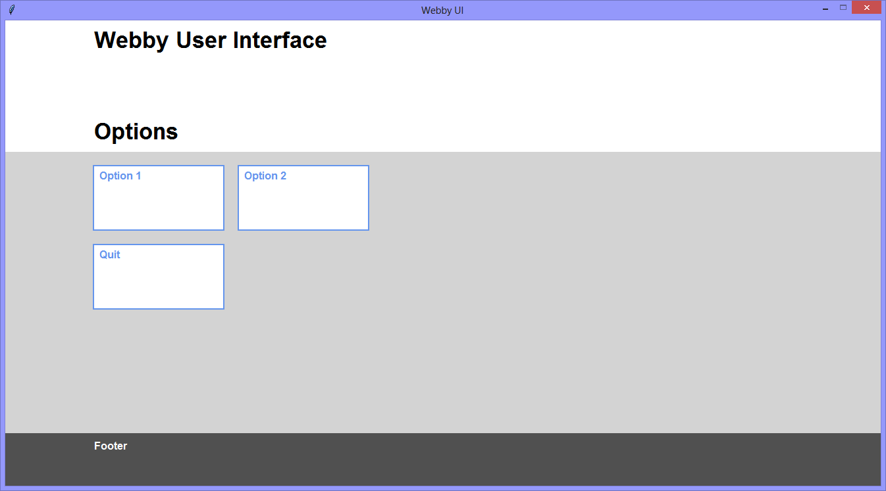

Continuing the exploration of using Tkinter with Python, this version
is a bit of fun - making the user interface look less-like an installed
application, and more like a web-application running in a browser.

Pressing 'F11' toggles the user interface between the 'in screen' default
view and the 'full screen' view.

||
|-|
||

```Python
# ---------- ---------- ---------- ---------- ---------- ---------- ---------- ----------
# Program ui_v1.29_webby_ui
# Written by: Joe Dorward
# Started: 16/11/2024

# This program:
# * creates the 'blank' tkinter user interface
# * adds the import reference to 'Label'
# * creates webby buttons from 'Label' widgets
# * Pressing 'F11' toggles the user interface between the 'in screen' default
#   view and the 'full screen' view.

from tkinter import Tk, Label

# the offsets are the horizontal and vertical spacing between widgets
x_offset = 20
y_offset = 20

button_height = 100
button_width = 2 * button_height
button_font = ('Arial', 12, 'bold')

header_font = ('Arial', 26, 'bold')
footer_font = ('Arial', 12, 'bold')
# ========== ========== ========== ========== ========== ========== ========== ==========
# FACTORY METHODS
# ========== ========== ========== ========== ========== ========== ========== ==========
def from_button_Wrapper_Factory(left, top, name):
    # the button-wrapper factory

    button_wrapper = Label(ui, background='CornflowerBlue', name=name)
    button_wrapper.place(x=left, y=top, width=button_width, height=button_height)
    return button_wrapper
# ---------- ---------- ---------- ---------- ---------- ---------- ---------- ----------
def from_button_Factory(parent_widget, text, name):
    # the button factory

    button = Label(parent_widget,
                   background='White',
                   foreground='CornflowerBlue',
                   font=button_font,
                   padx=6,
                   pady=3,
                   text=text,
                   justify='left',
                   anchor='nw',
                   name=name)
    
    button.place(x=0,
                 y=0,
                 width=button_width - 4,
                 height=button_height - 4)
    
    button.bind("<Button>", on_Click)
    button.bind("<Enter>", on_Enter)    
    button.bind("<Leave>", on_Leave)
# ========== ========== ========== ========== ========== ========== ========== ==========
def add_Header_Labels():

    label_width = fullscreen_ui_width
    label_height = 100
    padding_x = ui.winfo_width() / 10

    header_one = Label(ui,
                       background='White',
                       font=header_font,
                       text='Webby User Interface',
                       justify='left',
                       anchor='nw',
                       padx=padding_x,
                       pady=8,
                       name='header_one')    
    header_one.place(x=0, y=0, width=label_width, height=label_height)

    header_three = Label(ui,
                         background='White',
                         font=header_font,
                         text='Options',
                         justify='left',
                         anchor='sw',
                         padx=padding_x,
                         pady=8,
                         name='header_three')
    header_three.place(x=0, y=label_height, width=label_width, height=label_height)
    # ---------- ---------- ---------- ---------- ---------- ---------- ---------- ----------
def add_Footer_Labels():

    label_width = fullscreen_ui_width
    global label_height
    label_height = 80
    label_top = ui_height - label_height
    padding_x = ui.winfo_width() / 10

    global footer_one
    footer_one = Label(ui,
                       #background='DimGray',
                       background='#505050',
                       foreground='White',
                       font=footer_font,
                       text='Footer',
                       justify='left',
                       anchor='nw',
                       padx=padding_x,
                       pady=8,
                       name='footer_one')    
    footer_one.place(x=0, y=label_top, width=label_width, height=label_height)
    # ---------- ---------- ---------- ---------- ---------- ---------- ---------- ----------
def add_Buttons():
    # adds the buttons    
    print("[DEBUG] add_Buttons() called")

    button_top = y_offset + 200
    button_left = ui.winfo_width() / 10

    # ---------- ---------- ---------- ----------
    # 'option_1_button' wrapper & button
    option_1_button_wrapper = from_button_Wrapper_Factory(left=button_left,
                                                          top=button_top,
                                                          name='option_1_button_wrapper')
    
    option_1_button = from_button_Factory(parent_widget=option_1_button_wrapper,
                                          text='Option 1',
                                          name='option_1_button')
    # ---------- ---------- ---------- ----------
    # 'option_2_button' wrapper & button
    button_left = button_left + button_width + x_offset

    option_2_button_wrapper = from_button_Wrapper_Factory(left=button_left,
                                                          top=button_top,
                                                          name='option_2_button_wrapper')
    
    option_2_button = from_button_Factory(parent_widget=option_2_button_wrapper,
                                          text='Option 2',
                                          name='option_2_button')
    # ---------- ---------- ---------- ----------
    # 'quit' wrapper & button
    button_top = button_top + (y_offset + button_height)
    button_left = ui.winfo_width() / 10

    quit_button_wrapper = from_button_Wrapper_Factory(left=button_left,
                                                      top=button_top,
                                                      name='quit_button_wrapper')
    
    quit_button = from_button_Factory(parent_widget=quit_button_wrapper, 
                                      text='Quit',
                                      name='quit_button')
# ========== ========== ========== ========== ========== ========== ========== ==========
# KEYPRESS & MOUSE EVENT HANDLER METHODS
# ========== ========== ========== ========== ========== ========== ========== ==========
def on_Click(event):
    # handles button clicking

    if (event.widget.winfo_name() == 'option_1_button'):
        print("  Option 1 (clicked)")

    elif (event.widget.winfo_name() == 'option_2_button'):
        print("  Option 2 (clicked)")

    elif (event.widget.winfo_name() == 'quit_button'):        
        print("  Quit (clicked)")
        ui.quit()
    # ---------- ---------- ---------- ---------- ---------- ---------- ---------- ----------
def on_Enter(event):
    # handles mouse entering button
    event.widget.config(background='AliceBlue')
    # ---------- ---------- ---------- ---------- ---------- ---------- ---------- ----------
def on_Leave(event):
    # handles mouse leaving button
    event.widget.config(background='White')
    # ---------- ---------- ---------- ---------- ---------- ---------- ---------- ----------
def ui_Keypress_Handler(event):
    # handles <Key> press event
    print("[DEBUG] entry_One_Keypress_Handler() called")

    if (event.keysym == "F11"):
        print("ui.winfo_width()={}".format(ui.winfo_width()))

        if (ui.winfo_x() == fullscreen_ui_left): # toggle to default
            ui.geometry('%dx%d+%d+%d' % (ui_width, ui_height, ui_left, ui_top))
            footer_one.place(y=ui_height - label_height)
        else: # toggle to full-screen

            ui.geometry('%dx%d+%d+%d' % (fullscreen_ui_width,
                                         fullscreen_ui_height,
                                         fullscreen_ui_left,
                                         fullscreen_ui_top))
            
            footer_one.place(y=fullscreen_ui_height - label_height)
# MAIN ///// ////////// ////////// ////////// ////////// ////////// ////////// //////////
if __name__ == '__main__':        
    print("----------------------------------------------------")

    # create the 'blank' tkinter user interface
    ui = Tk()
    ui.title("Webby UI")

    # set default ui position & size
    ui_left = 10
    ui_top = 10
    ui_width = ui.winfo_screenwidth() - 36
    ui_height = ui.winfo_screenheight() - 60
    ui.geometry('%dx%d+%d+%d' % (ui_width, ui_height, ui_left, ui_top))

    # set 'full screen' ui position & size
    fullscreen_ui_left = -6
    fullscreen_ui_top = -29
    fullscreen_ui_width = ui.winfo_screenwidth() - 4
    fullscreen_ui_height = ui.winfo_screenheight() - 4

    ui.config(background='LightGray')
    ui.wm_resizable(width=False, height=False)
    ui.update()
    ui.bind("<Key>", ui_Keypress_Handler)

    # add controls    
    add_Header_Labels()
    add_Buttons()
    add_Footer_Labels()

    ui.mainloop()
    print("----------------------------------------------------\n")
```
