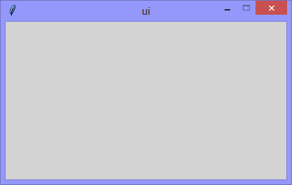

One of the coolest features of Tkinter, is the fact that the user interface
window and its widgets, exist as a hierarchy (like the folder structure
of an operating system) and are (therefore) iterable.

Continuing the exploration of using Tkinter with Python, this version
explores that hierarchy. In the structure of an operating system,
each folder has a unique path, and, in the hierarchy a Tkinter
application, each widget has a unique path. 

<p align="center">
  
</p>

When this application runs, the `list_Widgets()` prints the information
of the 'parent' user interface to the console.

```
[DEBUG] list_Widgets() called

The parent is:
  parent-name='tk' <- the 'name' of the user interface
  parent-title='ui' <- the 'title' of the user interface
  parent-path='.' <- the 'dot' is the parent-node of the path
```

```Python
# ---------- ---------- ---------- ---------- ---------- ---------- ---------- ----------
# Program ui_v1.30_nametowidget_parent.py
# Written by: Joe Dorward
# Started: 01/12/2024

# This program creates a Tkinter user interface
# * adds the import reference to 'Tk'
# * adds the import reference to 'Menu'
# * adds the menubar_1
# ui_v1.30_nametowidget_parent
# * shows the 'widgets' of the basic ui

from tkinter import Tk

# ========== ========== ========== ========== ========== ========== ========== ==========
# UTILLITY METHODS
# ========== ========== ========== ========== ========== ========== ========== ==========
def list_Widgets(parent_widget):
    # lists widgets
    print("----------------------------------------------------")
    print("[DEBUG] list_Widgets() called")

    # parent-widget
    print("\nThe parent is:")
    print("  parent-name='{}' <- the 'name' of the user interface".format(parent_widget.winfo_name()))
    print("  parent-title='{}' <- the 'title' of the user interface".format(parent_widget.title()))
    print("  parent-path='{}' <- the 'dot' is the parent-node of the path".format(parent_widget))
# MAIN ///// ////////// ////////// ////////// ////////// ////////// ////////// //////////
if __name__ == '__main__':        
    print("----------------------------------------------------")

    # create the 'blank' tkinter user interface
    ui = Tk()
    ui.title("ui")

    # set default ui position
    ui_left = 10
    ui_top = 10

    # set user interface proportions to 16:9
    ui_width = 16 * 25
    ui_height = 9 * 25
    ui.geometry('%dx%d+%d+%d' % (ui_width, ui_height, ui_left, ui_top))
    ui.config(background='lightgray')
    ui.wm_resizable(width=False, height=False)
    ui.option_add('*tearOff', False)

    list_Widgets(ui)

    ui.mainloop()
    print("----------------------------------------------------\n")
```
