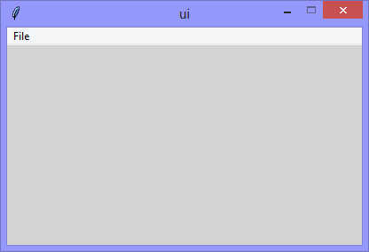

One of the coolest features of Tkinter, is the fact that the user interface
window and its widgets, exist as a hierarchy (like the folder structure
of an operating system) and are (therefore) iterable.

This version includes the exploration of that hierarchy to the grandchild
level.

<p align="center">
  
</p>

When this application runs, the `list_Widgets()` prints the information
of the 'parent' user interface to the console.

```Console
The parent is:
  parent-name='tk' <- the 'name' of the user interface
  parent-title='ui' <- the 'title' of the user interface
  parent-path='.' <- the 'dot' is the parent-node of the path

  The children are:
    parent-name='tk' <- 'master' is the equivalent of 'parent of'
    child-name='menubar_1' <- the 'name' of a child
    child-path='.menubar_1' <- the 'dot + name' is a child

    The grand-children are:
      parent-name='menubar_1' <- 'master' is the equivalent of 'parent of'
      grandchild-name='file_menu' <- the 'name' of a grandchild
      grandchild-path='.menubar_1.file_menu' <- adding a 'dot + name' for a grandchild path
```

The *parent* is the user interface
The *child* is the menubar
The *grandchild* is the file-menu

```Python
# ---------- ---------- ---------- ---------- ---------- ---------- ---------- ----------
# Program ui_v1.32_nametowidget_grandchild_menubar.py
# Written by: Joe Dorward
# Started: 01/12/2024

# This program creates a Tkinter user interface
# * adds the import reference to 'Tk'
# ui_v1.32_nametowidget_grandchild_menubar
# * adds the (showing) of the grandchild-widgets of the user interface

from tkinter import Tk, Menu

# ========== ========== ========== ========== ========== ========== ========== ==========
# MENUBAR
# ========== ========== ========== ========== ========== ========== ========== ==========
def add_Menubar(parent_widget):
    # adds menubar_1
    print("[DEBUG] add_Menubar() called")

    menubar_1 = Menu(parent_widget, name='menubar_1')

    # ---------- ---------- ---------- ---------- ---------- 
    # add file_menu to menubar_1
    file_menu = Menu(menubar_1, name='file_menu')
    menubar_1.add_cascade(menu=file_menu, label='File')
    
    # add options
    file_menu.add_command(label='Quit', command=parent_widget.quit)    
    # ---------- ---------- ---------- ---------- ----------

    # show menubar_1 in UI
    parent_widget['menu'] = menubar_1
# ========== ========== ========== ========== ========== ========== ========== ==========
# UTILLITY METHODS
# ========== ========== ========== ========== ========== ========== ========== ==========
def list_Widgets(parent_widget):
    # lists widgets
    print("----------------------------------------------------")
    print("[DEBUG] list_Widgets() called")

    # parent-widget
    print("\nThe parent is:")
    print("  parent-name='{}' <- the 'name' of the user interface"\
          .format(parent_widget.winfo_name()))
    print("  parent-title='{}' <- the 'title' of the user interface"\
          .format(parent_widget.title()))
    print("  parent-path='{}' <- the 'dot' is the parent-node of the path"\
          .format(parent_widget))

    # child-widgets
    print("\n  The children are:")
    for each_child in parent_widget.winfo_children():
        print("    parent-name='{}' <- 'master' is the equivalent of 'parent of'"\
              .format(each_child.master.winfo_name()))
        print("    child-name='{}' <- the 'name' of a child"\
              .format(each_child.winfo_name()))
        print("    child-path='{}' <- the 'dot + name' is a child"\
              .format(each_child))

        # grandchild-widgets
        print("\n    The grand-children are:")
        for each_grandchild in each_child.winfo_children():
            print("      parent-name='{}' <- 'master' is the equivalent of 'parent of'"\
                  .format(each_grandchild.master.winfo_name()))
            print("      grandchild-name='{}' <- the 'name' of a grandchild"\
                  .format(each_grandchild.winfo_name()))
            print("      grandchild-path='{}' <- adding a 'dot + name' for a grandchild path"\
                  .format(each_grandchild))
# MAIN ///// ////////// ////////// ////////// ////////// ////////// ////////// //////////
if __name__ == '__main__':        
    print("----------------------------------------------------")

    # create the 'blank' tkinter user interface
    ui = Tk()
    ui.title("ui")

    # set default ui position
    ui_left = 10
    ui_top = 10

    # set user interface proportions to 16:9
    ui_width = 16 * 25
    ui_height = 9 * 25
    ui.geometry('%dx%d+%d+%d' % (ui_width, ui_height, ui_left, ui_top))
    ui.config(background='lightgray')
    ui.wm_resizable(width=False, height=False)
    ui.option_add('*tearOff', False)

    add_Menubar(ui)
    list_Widgets(ui)

    ui.mainloop()
    print("----------------------------------------------------\n")
```
