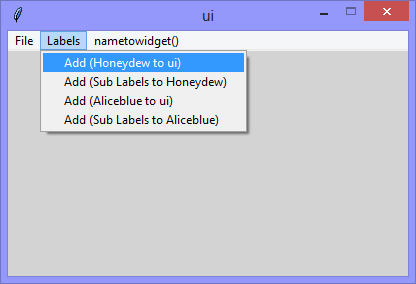
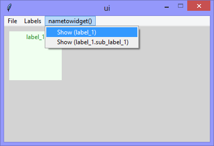
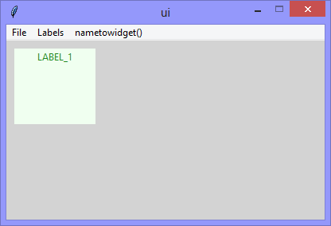

Continuing the exploration of using Tkinter with Python, this version includes
the exploration of the tkinter 'widget' hierarchy from the *parent* to *grandchild*,
while adding the use of the `nametowidget()` method.

||||
|-|-|-|
||||
